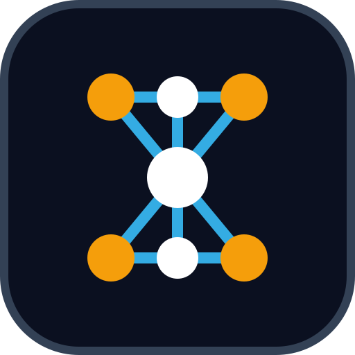

<p align="center"></p>

# Idrak

> **Idrak** (Arabic: **إدراك**, pronounced *id-RAAK*) means **perception, comprehension, awareness**: the act of
> taking in the world and coming to understand it. The name fits a library whose models learn to perceive patterns in
> data and to understand language.
>
> <p dir="rtl" lang="ar"><b>إدراك</b>: الفهم والوعي، والقدرة على استيعاب الأشياء ومعرفة حقيقتها. اخترنا الاسم لأن المكتبة تُعلِّم النماذج أن تُدرِك الأنماط في البيانات وأن تفهم اللغة.</p>

**Deep learning in pure .NET. Every GPU. Zero dependencies.**

A self-contained deep-learning library for **.NET 10**, written in C#, with its own GPU kernels for every backend.
The core has **no NuGet dependencies and no native libraries**: no TensorFlow, no PyTorch, no CUDA Toolkit, no cuBLAS
or cuDNN, no shader compiler. Kernels are generated in C# (PTX for NVIDIA, SPIR-V for Vulkan, HIP C for AMD) and
compiled by the GPU's own driver on the user's machine.

- **Build and train networks**: N-D tensors with automatic differentiation; dense, convolutional, recurrent,
  attention and transformer layers; losses, optimizers (including 8-bit AdamW) and schedules; a trainer, data
  loaders for data that is not in memory, predictors, model packages, telemetry and resource limits; vision building
  blocks for classification of objects, detection and segmentation (see "Vision").
- **Run and fine-tune language models**: Llama, Qwen, Mistral, Gemma (1, 2 and 3) and the mixture-of-experts Mixtral
  and Qwen-MoE from Hugging Face folders or GGUF files, with their own tokenizers and chat templates; streaming chat
  with reasoning and tool calls; LoRA, DoRA and QLoRA fine-tuning, DPO / ORPO / SimPO, knowledge distillation from a
  teacher; answer scoring and evaluation.
- **Every GPU, one code base**: CUDA on NVIDIA (bfloat16 and FP8 tensor cores, flash attention, CUDA graphs), Vulkan
  on NVIDIA, AMD, Intel and phone GPUs such as Qualcomm Adreno (fused decoding kernels, recorded graphs, cooperative
  matrices), a first HIP backend for AMD, and SIMD CPU kernels on x64 and ARM64 (Windows, Linux, macOS, Android).
  Kernel choices are measured on the user's device, never looked up by a card's name.
- **Open where it matters**: more than twenty registries take formats, model families, tokenizer parts, samplers, KV
  cache layouts, tool-call formats, data sources, image codecs, losses, optimizers and differentiable operations
  from any package (see "Plug-in points").
- **Use it in applications**: an inference engine with batching, ASP.NET Core endpoints (a local chat API and an
  OpenAI-style `/v1` API), retrieval and RAG, MCP tools, ONNX export and import, datasets from files and hubs, and
  one command-line tool, `idrak`, for all of it: checks, chat, a web chat page, serving, models, benchmarks,
  fine-tuning, distillation, training, data, retrieval and network design.

| Backend | How it works | Requirements |
|---------|--------------|--------------|
| **CPU** | `Vector<T>` SIMD kernels (AVX2, AVX-512, NEON), register-tiled matrix products sized from the CPU's caches, multi-threading measured per machine, pooled buffers | Any machine running .NET 10 (x64 or ARM64) |
| **CUDA** | P/Invoke straight into the NVIDIA **driver** API (`nvcuda.dll` / `libcuda.so.1`); PTX kernels generated in C# (`PtxKernels.cs`), JIT-compiled by the driver for the installed GPU | An NVIDIA GPU and display driver. No CUDA Toolkit, cuBLAS, cuDNN or NVRTC |
| **Vulkan** | Compute through the Vulkan loader; SPIR-V kernels generated in C# (`KernelBuilder`), with the kernels' width, memory path and cooperative-matrix use measured on the device | Any GPU with a Vulkan 1.1+ driver (`vulkan-1.dll`, `libvulkan.so.1`, Android's `libvulkan.so`) |
| **HIP** (first slice) | The HIP runtime and hipRTC compile kernels written as source; memory, copies and a first set of kernels on the device, the rest through host fallbacks | ROCm (Linux) or the HIP SDK (Windows) and an AMD GPU; not yet run on one |

`Device.Default` picks a CUDA GPU when there is one, else the CPU; a HIP GPU (`IDRAK_HIP_DEFAULT=1`) or a Vulkan GPU
(`IDRAK_VULKAN_DEFAULT=1`) only when asked, and any device by name: `Device.Parse("vulkan:0")`, or `-d vulkan:0` in the
tool. `IDRAK_DISABLE_CUDA=1` (and `_VULKAN`, `_HIP`) turns a backend off.

## What Idrak gives you

### Packages

| Package | What it gives you |
|---------|-------------------|
| `Idrak` (core) | Tensors and autograd, layers, training, vision, generation, chat and tools, retrieval, the inference engine, telemetry, every backend |
| `Idrak.Abstraction` | The contracts Idrak is built on, each with its default implementation: so far `Device`, `ComputeResources` and the CPU device (preview; brought along by `Idrak`; see [plan 10](plans/10-abstraction.md)) |
| `Idrak.LanguageModels` | Hugging Face and GGUF models, tokenizers, the models' own Jinja chat templates, LoRA / QLoRA fine-tuning, evaluation |
| `Idrak.Datasets` | JSON Lines, JSON, CSV, text, code and Parquet files (also compressed or archived); Hugging Face, GitHub, Kaggle, Zenodo and URL sources |
| `Idrak.AspNetCore` | `AddIdrak()`, `MapPredictor`, `MapGenerate` (JSON and streaming), `MapChatApi` (the local chat API) and `MapCompletionsApi` (`/v1`) |
| `Idrak.Mcp` | Tools of Model Context Protocol servers, and serving tools over MCP |
| `Idrak.Onnx` | Export to `.onnx` (opset 17) and import `.onnx` into layers |
| `Idrak.Onnx.Runtime` | Run `.onnx` models with ONNX Runtime as Idrak modules |
| `idrak` (CLI, package `Idrak.Cli`) | One tool for the whole library: `doctor`, `devices`, `chat`, `run`, `serve`, `pull`, `list`, `bench`, `tune`, `train`, `data`, `rag`, `suggest` and more (see "idrak: the command-line tool") |

### Building and training models

| Area | What is there |
|------|---------------|
| Layers | Linear, Conv2d, pooling, BatchNorm, LayerNorm, Embedding, LSTM, GRU, multi-head attention, transformer layers, dropout, activations; graph modules (skip connections, branches) |
| Building | A fluent network builder with a JSON round trip; ready-made architectures |
| Training | `Trainer`, losses (MSE, MAE, cross-entropy, binary cross-entropy, per-pixel cross-entropy), metrics, early stopping, duplicate removal before splits |
| Data | In-memory datasets and lazy sources (streamed CSV, image folders, memory-mapped token files and .npy arrays, Parquet and JSON Lines columns), views, image augmentation, PNG/BMP/PGM/PPM decoding without dependencies |
| Optimizers | SGD, Adam, AdamW (fused on the GPU), 8-bit Adam, a learning rate per group; step, exponential and cosine (with warm-up) schedules; gradient clipping |
| Precision | float32; bfloat16 and FP8 tensor cores; int8, int4 and bfloat16 weights; half-precision files |
| Memory | Offloading to system memory, activation memory limits, deterministic freeing |
| Speed | Recorded graphs (CUDA and Vulkan), fused kernels, choices measured on the device and stored |
| Vision | Per-channel normalization as a layer (`Normalize`, ImageNet's or a data set's statistics); foreground extraction (Otsu); connected components; content framing for classifiers of single objects; region classification in batches; boxes, IoU and non-maximum suppression with a detector over any network; segmentation masks, per-pixel cross-entropy and IoU metrics with a segmenter over any network |

### Language models and generation

| Area | What is there |
|------|---------------|
| Model families | Llama, Mistral, Qwen2/3, Gemma 1/2/3 (sliding windows, soft-capping, YaRN and dynamic RoPE); mixture of experts: Mixtral, Qwen2-MoE, Qwen3-MoE; a registry for more |
| Weight formats | safetensors; GGUF (F32/F16/BF16, Q4_0 to Q8_0, K-quants, IQ4) |
| Generation | Streaming, batches, sampling (temperature, top-k/p, min-p, penalties), float32, int8 or bfloat16 KV caches |
| Chat | Each model's own Jinja template, reasoning, tool calls, conversations, a coding agent |
| Fine-tuning | LoRA, DoRA and QLoRA, packing, assistant-only loss, DPO / ORPO / SimPO on preference pairs, knowledge distillation from a teacher (its token probabilities, on the fly or stored as top-k, or its written answers), any optimizer, schedule or loss, PEFT adapters (checked), merged export |
| Evaluation | Answer scoring by log-probabilities, answer metrics |

### Retrieval, serving and deployment

| Area | What is there |
|------|---------------|
| Retrieval and RAG | Chunking, BM25, bi-encoder vectors, hybrid search with rank fusion, cross-encoder re-ranking, a pipeline that cites passages |
| Serving | The inference engine (loading, batching), model packages (`.ikm`), Web API endpoints, a local chat API (`/api/chat`), MCP |
| Interop | ONNX import and export; reference checks against PyTorch and transformers |
| Telemetry | Hooks that cost nothing when unused: console, CSV metrics, JSON Lines; training, batch, gradient and layer events |

### Plug-in points

Each registry takes an implementation from any package, next to the built-ins (details in "Extending Idrak: plug-in
points"):

| What plugs in | Registry or hook | Package |
|---------------|------------------|---------|
| Token sampling | `ITokenSampler` through `TextGenerator.CreateSampler` | `Idrak` |
| KV cache formats | `KeyValueLayouts` | `Idrak` |
| Packed weight formats | `PackedWeight` | `Idrak` |
| Network builder steps | `NetworkOps` | `Idrak` |
| Graph operations and graph layer types | `GraphOps`, `LayerTypes` | `Idrak` |
| RoPE scaling methods | `RopeScalings` | `Idrak` |
| Telemetry listeners | `Telemetry.Subscribe` | `Idrak` |
| Tool-call formats | `ToolCallFormats` | `Idrak` |
| ONNX import operators | `OnnxImportOps` | `Idrak.Onnx` |
| ONNX export of modules, lambdas and graph operations | `OnnxExportOps` | `Idrak.Onnx` |
| Checkpoint formats | `CheckpointFormats` | `Idrak.LanguageModels` |
| Model families (a spec, or a network built by the family) | `PretrainedArchitectures` | `Idrak.LanguageModels` |
| GGUF architectures, quantization types, pre-tokenizers | `GgufArchitectures`, `GgufTypes`, `GgufPreTokenizers` | `Idrak.LanguageModels` |
| Model sources | `ModelSources` | `Idrak.LanguageModels` |
| Tokenizer normalizers, pre-tokenizers, decoders | `TokenizerComponents` | `Idrak.LanguageModels` |
| Dataset file formats, sources, Parquet codecs | `DataFileFormats`, `DatasetSources`, `ParquetCodecs` | `Idrak.Datasets` |
| Training data: samples, streams, transforms, batches | `ISampleSource`, `ISampleStream`, `ISampleTransform`, `IBatchSource`; sources by name in `SampleSources` | `Idrak` |
| Image formats (a JPEG decoder, for example) | `ImageCodecs` | `Idrak` |
| Optimizers | derive from `Optimizer` | `Idrak` |
| Differentiable operations | `Autograd.Function(name, forward, backward)` | `Idrak` |
| Adapters on linear layers | `ILinearAdapter` (LoRA and DoRA built in) on `Linear.Adapter` | `Idrak` |
| Fine-tuning optimizer, schedule and loss | `FineTuningOptions.Optimizer`, `Scheduler`, `Loss` | `Idrak.LanguageModels` |
| Devices (backends) | the device registry, internal until the public backend API (plans/7-backends.md, item 12c) | `Idrak` |

### Hardware

| Backend | Devices | Status |
|---------|---------|--------|
| CPU | x64 (AVX2, AVX-512), ARM64 (NEON) | Every test passes, including on an Android phone and an Apple M4 Max (macOS) |
| CUDA | NVIDIA GPUs, through the driver API | Every test passes on Turing, Ampere and Blackwell GPUs |
| Vulkan | NVIDIA, AMD, Intel, Qualcomm Adreno, Mesa's software driver | Every test passes on each GPU tested (see "Tested on architectures") |
| ROCm / HIP | AMD GPUs through the HIP runtime: memory, copies and a first set of kernels, the rest through host fallbacks | Added; not yet run on an AMD GPU |
| Metal, NPUs | Apple GPUs (macOS runs on the CPU backend for now) | Not supported yet |

## Install

**Libraries**: add them to a project (`dotnet add package`, run in the project's folder):

```bash
dotnet add package Idrak                      # tensors, layers, training, generation; every backend
dotnet add package Idrak.LanguageModels       # Hugging Face and GGUF language models, fine-tuning
dotnet add package Idrak.Datasets             # datasets from files, Hugging Face, GitHub, Kaggle, Zenodo, URLs
dotnet add package Idrak.AspNetCore           # serve models from ASP.NET Core
dotnet add package Idrak.Mcp                  # Model Context Protocol tools
dotnet add package Idrak.Onnx                 # ONNX export
dotnet add package Idrak.Onnx.Runtime         # run ONNX models with ONNX Runtime
```

**Command-line tool**: install once, then run it from any folder (no project needed; `Idrak.Cli` is the tool, the
other packages are libraries):

```bash
dotnet tool install -g Idrak.Cli              # the idrak command (idrak help lists every command)
idrak doctor                                  # what works on this machine and what to fix
dotnet tool update -g Idrak.Cli               # later: update to the newest version
```

**From source** (everything on `main`, also what is not released yet); the .NET 10 SDK is the only requirement:

```bash
git clone https://github.com/ahmedseada/Idrak.git && cd Idrak
dotnet build -c Release
dotnet run -c Release --project tests/Idrak.Tests -- --list-devices    # the devices found and how to test each
dotnet pack src/Idrak.Cli -c Release -o pkg
dotnet tool install -g Idrak.Cli --add-source pkg --prerelease          # the idrak command from this checkout
idrak test -d cpu                                                       # the test suite on one device
```

Step-by-step guides for Windows, Linux and WSL2, macOS and Android phones (Termux): [installation/](installation/README.md).

## idrak: the command-line tool

`idrak` runs the library from the command line, with nothing else to install: about a hundred commands in ten groups
that check the machine, chat with and serve language models (with a web chat page), manage the model cache, benchmark,
fine-tune, distil and train, prepare data, build retrieval indexes, design networks for a data set and run the tests. Text by default, `--json` for scripts, the same options and short forms in every
command (`-d vulkan:0`, `-w int8`, `-k int8`, `--offline`, `--cache DIR`, ...).

```bash
idrak doctor                                   # what works on this machine and what to fix
idrak dev                                      # the devices and what each offers
idrak pull Qwen/Qwen3-0.6B                     # into the cache, with progress and resume
idrak c Qwen/Qwen3-0.6B -d vulkan:0 -w int8    # chat on the GPU with int8 weights
cat notes.txt | idrak r Qwen/Qwen3-0.6B "Summarize in three bullets"
idrak s Qwen/Qwen3-0.6B -p 8080                # the chat API and the OpenAI-style API on one port
idrak ui Qwen/Qwen3-0.6B -w int8               # the same server and a web chat page in the browser
idrak tune train Qwen/Qwen3-0.6B data.jsonl --out adapters/qa   # LoRA fine-tuning (DoRA, QLoRA, DPO, ...)
idrak distill --teacher Qwen/Qwen3-8B --student Qwen/Qwen3-0.6B --data chats.jsonl -o adapters/d
idrak env set                                  # save environment variables for every run, in any shell
idrak b Qwen/Qwen3-0.6B --devices all          # tokens per second on every device, in one table
idrak sg houses.csv -t SalePrice -e            # design a network for a CSV, with the reasons
idrak help                                     # every command by group; idrak help COMMAND for one
```

`idrak serve` listens on port 7317 by default (`-p`, `IDRAK_PORT` or the config's `serve.port` choose another): point
clients at `http://127.0.0.1:7317` for the chat API or `http://127.0.0.1:7317/v1` for the OpenAI-style API, or serve
with `-p 11434` for clients that expect the chat API on that port.
`--lang ar` prints the tool's messages in Arabic (help, errors, `doctor`, `devices`, the chat), shaped and reordered
by the tool for terminals that do not show right-to-left text themselves (`idrak help arabic`); JSON stays English.

The commands, options, examples and environment variables are in [src/Idrak.Cli/README.md](src/Idrak.Cli/README.md)
(and in `idrak help`); the design is [plans/idrak-cli.md](plans/idrak-cli.md).

Licensed under the [Apache License 2.0](LICENSE) (see [NOTICE](NOTICE)) from 0.1.7 on; versions up to 0.1.6 were released under the MIT license. Contributions: see [CONTRIBUTING.md](CONTRIBUTING.md) and the [CLA](CLA.md). Releases are listed in the [changelog](CHANGELOG.md).

## Layout

```
src/Idrak/
  Tensor*.cs                        N-D tensors, operators, autograd, shape ops, number-type interop
  Device.cs, ComputeResources.cs    devices; thread and memory budgets
  Autograd.cs, TensorScope.cs       NoGrad(); deterministic disposal
  Losses.cs                         MSE, MAE, CrossEntropy, BinaryCrossEntropy(WithLogits), token log-probabilities
  MixedPrecision.cs, ComputeGraph.cs  tensor-core precision (bfloat16, FP8); CUDA graph capture and replay
  Sampling.cs                       the token sampler (temperature, top-k/p, min-p, penalties)
  Layers/                           Linear, Conv2d, MaxPool2d, GlobalAveragePool2d, Flatten,
                                    BatchNorm, LayerNorm, Embedding, LSTM, GRU,
                                    MultiHeadAttention, TransformerEncoderLayer, PositionalEncoding,
                                    ReLU, Tanh, Sigmoid, GELU, Softmax, Dropout, Lambda, Sequential;
                                    Network builder, Blocks, Architectures; GraphModule (layers in a graph: skip
                                    connections, branches); freezing, LoRA (ModuleExtensions)
  Optimizers/                       Sgd, Adam, AdamW, GroupedOptimizer, schedulers (step, exponential, cosine + warm-up)
  Data/                             Dataset (CSV, class labels, feature shapes), sample sources (CSV, images, tokens, .npy),
                                    views, image codecs and transforms, scalers, DataLoader, DataExtensions
  Training/                         Trainer, TrainingRun, Metric (MAE, RMSE, Accuracy), RegressionReport
  Generation/                       tokenizers, TextGenerator (streaming, batches), chat, Conversation, tools
                                    (ToolRegistry), ModelHost, CodingAgent and CodingTools
  Inference/                        Predictor, ModelPackage (.ikm), InferenceEngine
  Retrieval/                        chunking, BM25, TextEncoder (bi-encoder), VectorIndex, RetrievalIndex (hybrid
                                    search with rank fusion), CrossEncoder (re-ranking), Rag pipeline, search tool
  Vision/                           Foreground (Otsu), ConnectedComponents, ContentFrame, RegionClassifier
                                    (IRegionProposer), boxes and NonMaxSuppression, ModelDetector (IObjectDetector),
                                    SegmentationMask, SegmentationMetrics, ModelSegmenter (ISegmenter), ChannelStatistics
  Diagnostics/                      Telemetry hub, events, ConsoleLogger, MetricsRecorder,
                                    ChannelTelemetry, JsonLinesLogger
  Backends/                         the device backends: Cpu (SIMD kernels, measured tiling), Cuda (PTX kernels
                                    generated in C#), Vulkan (SPIR-V generated by SpirV/KernelBuilder; fused decoding,
                                    graphs, cooperative matrices), Hip (hipRTC kernels), the minimum backend with host
                                    fallbacks every new device starts from, and the device registry
src/Idrak.LanguageModels/           optional package, no dependencies: language models and fine-tuning
  PretrainedModel, Architectures    Hugging Face folders; the architecture registry (Llama, Mistral, Qwen2/3, Gemma 1/2/3,
                                    Mixtral, Qwen2-MoE, Qwen3-MoE)
  SafeTensors, Gguf, GgufModel      safetensors and GGUF weights (F32/F16/BF16, Q4_0–Q8_0, K-quants, IQ4)
  BpeTokenizer, Jinja, ChatTemplates  tokenizer.json; the model's own Jinja chat template; tool-call formats
  FineTuning, TuningManifest        LoRA / DoRA / QLoRA fine-tuning, preference losses, distillation (a teacher model or
                                    stored top-k logits), packing, CUDA graphs, memory fallbacks; adapters
  AnswerScorer, Evaluation          log-probabilities of given answers, answer metrics
  ModelSource                       Hugging Face ids: found in a cache or downloaded once
src/Idrak.Datasets/                 optional package, no dependencies: JSON Lines, JSON, CSV, text, code and Parquet
                                    files (also compressed and archived); Hugging Face, GitHub, Kaggle, Zenodo and URL
                                    sources with a download cache; rows into conversations; recipes
src/Idrak.AspNetCore/               optional package: AddIdrak(), MapPredictor, MapGenerate, MapChatApi, MapIdrakStatus
src/Idrak.Mcp/                      optional package: tools of Model Context Protocol servers, and serving tools over MCP
src/Idrak.Onnx/                     optional package, no dependencies: export networks to .onnx (opset 17), import .onnx into layers
src/Idrak.Onnx.Runtime/             optional package: run .onnx models with ONNX Runtime as Idrak modules
src/Idrak.Cli/                      idrak: the command-line tool (commands under Commands/ in ten groups, shared helpers
                                    under Shared/: the environment table, saved variables, Arabic shaping and bidi)
samples/
  Idrak.Samples.Xor                 the classic XOR problem
  Idrak.Samples.HousePrices         regression: predict house prices from a CSV file
  Idrak.Samples.HouseApi            house-price Web API in a few lines (Idrak.AspNetCore + the HousePrices package)
  Idrak.Samples.Spirals             multi-class: 3 spirals, softmax + cross-entropy, BatchNorm
  Idrak.Samples.ShapeRecognition    CNN: classify drawn shapes (Conv2d, MaxPool2d, BatchNorm) from an image folder, augmented
  Idrak.Samples.Ocr                 OCR: CNN character recognizer + line segmentation, trained from an image folder, reads PNG/BMP/PGM
  Idrak.Samples.Sentiment           sentiment with negation: bag-of-words vs LSTM, GRU, Transformer
  Idrak.Samples.TextGeneration      small GPT: character-level causal transformer that generates text
  Idrak.Samples.GptApi              ASP.NET Core Web API + browser UI serving the GPT (Scalar docs, streaming, the chat API on /api/chat)
  Idrak.Samples.GptTraining         trains a full-size character-level GPT (bfloat16 / FP8 tensor cores, checkpoints, resume)
  Idrak.Samples.Summarizer          summarization: extractive baselines vs a word-level transformer (WordTokenizer + TextGenerator)
  Idrak.Samples.ReRanker            search re-ranking: BM25 first stage + transformer cross-encoder, listwise training
  Idrak.Samples.Rag                 retrieval-augmented generation: hybrid search, re-ranking, a chat model that cites passages
  Idrak.Samples.Quantization        int8 weights and Float16/BFloat16 files: accuracy, size and decoding speed
  Idrak.Samples.OnnxImport          imports another framework's .onnx model, runs it on Idrak (CPU/CUDA), checks its outputs
  Idrak.Samples.Chat                chat with a Hugging Face or GGUF language model: info, chat, profile, and a check against transformers
  Idrak.Samples.CodingAgent         a coding agent (read, search, edit, run commands) on a language model, and a task-suite runner
  Shared/SampleOptions.cs           command-line options shared by the samples (train / predict modes)
  Shared/Gpt/                       GPT model, generation with metrics, training (console + Web API)
tests/Idrak.Tests                   self-contained test runner: every test on the CPU and on every CUDA, Vulkan and HIP
                                    GPU present; benchmarks (--bench-cpu, --bench-vulkan, --bench-window, ...)
tests/Idrak.PluginTests             plug-ins written outside the library (public API only), loaded by the runner
  data/                             small GGUF, safetensors and Parquet fixtures (made by the scripts in tools/)
tools/
  pytorch/xor_to_onnx.py            trains XOR in PyTorch and exports it to ONNX with PyTorch's outputs, for OnnxImport
  pytorch/export_models.py          exports a PyTorch CNN or ResNet (skip connections) to ONNX with PyTorch's outputs
  pytorch/pretrained_reference.py   records transformers' ids, templates, logits and greedy output, for `Chat check`
  gguf/make_fixtures.py             the GGUF test fixtures (every quantization type, tiny Llama and Qwen3 models)
  datasets/make_parquet_fixtures.py the Parquet test fixtures, with the rows pyarrow reads
  unicode/                          the Unicode tables and bidi test lines behind the tool's Arabic output
  publish.ps1                       publishes a release tag to nuget.org from a machine (when CI cannot)
docs/                               performance notes (where optimization stopped) and items to review
plans/                              design plans: backends, Vulkan, HIP, plug-in points, the idrak tool, open questions
installation/                       how each tested machine was set up, step by step (Windows, Linux, macOS, Android)
assets/                             the icon (icon.svg source, icon.png for the packages)
```

## Samples

| Sample | Shows | Typical CPU result |
|--------|-------|--------------------|
| `Xor` | smallest possible network | 4/4 correct in 0.1 s |
| `HousePrices` | CSV loading, scaling, regression, early stopping | R² 0.975, 5.3% mean error, 1 s |
| `Spirals` | softmax + cross-entropy, BatchNorm, AdamW, cosine schedule, confusion matrix | 97.8% accuracy, 2.4 s |
| `ShapeRecognition` | Conv2d, MaxPool2d, BatchNorm, Flatten on 16×16 images read from class folders, with flips, shifts and noise each epoch | 100% accuracy, about 20 s |
| `Sentiment` | Embedding, LSTM, GRU, Transformer vs an order-blind baseline | LSTM/GRU/Transformer 99.5–100%, bag of words 70% |
| `Ocr` | CNN over 36 characters from class folders with shifts and noise each epoch, projection-profile segmentation, PNG/BMP/PGM input | 100% per character, 99.9% of characters across whole lines |
| `TextGeneration` | decoder-only GPT: causal attention, sparse cross-entropy, sampling | 89% next-character accuracy, 100% real words generated |
| `GptApi` | serving a model: REST + server-sent events, Scalar, browser UI, the chat API on `/api/chat` | about 600 characters/s on 4 CPU cores |
| `ReRanker` | two-stage search: BM25 + cross-encoder, hard negatives, listwise loss, placeholder tokens for unseen names | Hit@1 on unseen towns 27.1% (BM25) → 86.6% re-ranked, 6.9 ms per question, 180 s training |
| `HouseApi` | `AddIdrak().AddPredictor(...)` + `MapPredictor`: the HousePrices package served over HTTP with micro-batching | same prices as `HousePrices --predict` |
| `Summarizer` | word-level decoder-only transformer, loss masking, greedy generation with a stop token, ROUGE | ROUGE-1 0.999 vs 0.503 (first sentence), 90% exact, 7.7 ms per summary |
| `Quantization` | `QuantizeInt8`, int8 KV cache, Float16/BFloat16 files: a trained summarizer compared with float32, and decoding speed and memory of a 98M-parameter GPT | int8 weights + int8 KV cache: same summaries as float32 on all 300 test reports, ⅓ of the file; on 4 CPU threads, weights 373 → 112 MB, KV cache 18 → 4.8 MB, decoding 19.8 → 45.7 tokens/s |
| `OnnxImport` | `OnnxImport.Load(path, device)` on a PyTorch-exported model (`tools/pytorch/xor_to_onnx.py`, `export_models.py` for a CNN or ResNet), compared with PyTorch's own outputs, then saved as .ikm and reloaded | XOR: same outputs as PyTorch on the RTX 5050 (1e-11), both PyTorch exporters |
| `Rag` | `RetrievalIndex` (BM25 + trained bi-encoder + rank fusion), `CrossEncoder` re-ranking, `Rag.For(chat)` with a word-level ChatML model that cites passages; hashing and placeholder tokens for unseen names | unseen towns: Hit@1 27.1% (BM25), 85.8% (hybrid), 99.9% (re-ranked); answers 91.1% correct (0% closed book), 99.9% cite the right passage; 14 min training |
| `Chat` | `PretrainedModel.Load(folder)` on a Hugging Face model folder; `chat` in the model's own template (reasoning, tool calls); `check` against a reference from `tools/pytorch/pretrained_reference.py` (token ids, chat templates, logits, greedy output) | on small Qwen3- and Llama-layout models built here (trained `tokenizers` tokenizers, transformers' `apply_chat_template`, a NumPy port of the Hugging Face forward pass): identical ids, templates and greedy text, logits within 1e-5 (F32 and BF16 files, sharded, SentencePiece and byte-level) |
| `CodingAgent` | `CodingAgent` + `CodingTools` on any model `PretrainedModel` loads: `agent` works on a task in a folder (streams reasoning and tool calls); `agent-run` scores a model on a suite of tasks, each verified by its own commands; `agent-check` checks a suite without a model | runs every task in a fresh copy of its workspace |

Convolutional samples built on the released packages, with datasets fetched by `idrak data download`, are in their
own repository, [ahmedseada/CNN](https://github.com/ahmedseada/CNN):

| Sample | Shows |
|--------|-------|
| `DigitsCnn` | handwritten digits (MNIST): the fluent CNN builder, augmentation, early stopping that keeps the best epoch, `idrak predict` on the package |
| `LettersCnn` | handwritten English letters (EMNIST Letters), accuracy per class and the most common mistakes |
| `DocumentOcr` | a handwritten page read character by character (EMNIST Balanced) with line and character segmentation |
| `MultiLanguageOcr` | English and Arabic handwriting (EMNIST Balanced, AHCD, MADBase) in one 85-character model, script per line, right-to-left output: 92.5% per character, 2.4% character error rate on its demo page (RTX 5070 Ti) |

### Train and predict modes

Every console sample trains, saves its model under `models/` (next to the executable), and can then run
**inference only** from the saved model:

```bash
dotnet run -c Release --project samples/Idrak.Samples.HousePrices                       # train + save
dotnet run -c Release --project samples/Idrak.Samples.HousePrices -- --predict --input "2100,4,2,15,9.5,7,2,0,6500"
dotnet run -c Release --project samples/Idrak.Samples.Sentiment -- --predict --input "the movie was not good;not bad at all"
dotnet run -c Release --project samples/Idrak.Samples.Ocr -- --predict --input "HELLO WORLD 2026"
dotnet run -c Release --project samples/Idrak.Samples.Ocr -- --predict --image scan.pgm
dotnet run -c Release --project samples/Idrak.Samples.ReRanker -- --predict --input "how many people live in armor"
dotnet run -c Release --project samples/Idrak.Samples.Summarizer -- --predict --input "the lions played the owls in kelso on friday . the owls scored 2 goals . the lions scored 4 goals ."
dotnet run -c Release --project samples/Idrak.Samples.TextGeneration -- --predict --input "the old wizard " --temperature 0.8
```

| Sample | `--input` in predict mode |
|--------|---------------------------|
| `Xor` | `"a,b;a,b"` bit pairs |
| `HousePrices` | 9 features per house, `;` between houses (or `--data file.csv` to price every row) |
| `Spirals` | `"x,y;x,y"` points in [-1, 1] |
| `ShapeRecognition` | shape names to draw and classify, e.g. `"circle,cross"` |
| `Sentiment` | sentences separated by `;`, judged by all four saved models side by side |
| `Ocr` | text to render and read (or `--image file.pgm`) |
| `TextGeneration` | prompt to continue (`--length`, `--temperature`, `--top-k`) |

Everything a model needs at inference time is saved next to its weights. That includes the scalers for
house prices, the BatchNorm running statistics, and the GPT's vocabulary and architecture (a `.json`
file). `--model <path>` chooses another location.

### GPT Web API

```bash
dotnet run -c Release --project samples/Idrak.Samples.GptApi
# http://localhost:5080         inference UI
# http://localhost:5080/scalar  API reference (Scalar)
```

| Endpoint | Purpose |
|----------|---------|
| `GET /api/status` | Loading / Training (with live progress) / Ready / Failed |
| `GET /api/model` | parameters, blocks, heads, width, context, vocabulary, validation results, layer summary |
| `GET /api/devices` | CPU and CUDA GPUs with memory usage and the active one |
| `POST /api/generate` | one or more samples, each character's probability, entropy, top-5 alternatives and latency, plus aggregate metrics (including decoding mode) |
| `POST /api/generate/stream` | the same as server-sent events: `token` events (with their sample index) every `chunkSize` characters, then `metrics` |

The request body is `{ "prompt", "length", "temperature", "topK", "seed", "device": "cpu" | "cuda",
"samples", "useCache", "useGraph", "chunkSize" }`. The UI has matching controls: a samples slider
(shown as tabs), and KV cache and CUDA graph switches for comparing modes.
The device can change per request, and the model moves between CPU and GPU as needed.

The service loads `Gpt:ModelPath` from `appsettings.json`. Point it at a model saved by the
`TextGeneration` sample (or pass `--Gpt:ModelPath path`). When no model exists, the service trains one in
the background and reports progress through Idrak telemetry.

The browser UI (`wwwroot/index.html`, dark and light themes, responsive) is laid out in two columns:
- **Left:** the streamed output, with each character coloured by the model's confidence (hover a
  character for its alternatives, click it for the token inspector); metric cards for throughput,
  total time, first-token latency, time per token, confidence, perplexity, entropy and device
  memory; and live confidence and latency charts.
- **Right:** prompt, length, temperature, top-k, seed and streaming controls; the CPU/GPU switch; and
  the model's parameters and layer summary.

All samples take the same options:

```bash
dotnet run -c Release --project samples/Idrak.Samples.HousePrices               # GPU if available, else CPU
dotnet run -c Release --project samples/Idrak.Samples.HousePrices -- --cpu      # force CPU
dotnet run -c Release --project samples/Idrak.Samples.HousePrices -- --cuda     # force GPU
dotnet run -c Release --project samples/Idrak.Samples.Xor -- --help
```

| Option | Meaning |
|--------|---------|
| `--device auto\|cpu\|cuda\|cuda:N`, `--cpu`, `--cuda` | where to run |
| `--threads N` | CPU threads to use (default: all cores) |
| `--gpu-memory MiB`, `--cpu-memory MiB` | cap tensor memory (default: unlimited) |
| `--epochs N`, `--batch-size N` | training settings |
| `--log training,batches,gradients,layers,operations,inference,all` | what the console logger prints |
| `--log-file run.jsonl` | also write telemetry as JSON Lines |
| `--data path.csv` | dataset file (house prices) |

The house-price sample loads `data/houses.csv`: 2,500 synthetic but realistic listings with 9 features
(area, bedrooms, bathrooms, age, distance to the city centre, quality, garage, pool, lot size).
It splits them 80/20, standardizes features and prices, and trains a 9→64→32→1 network with
dropout, Adam and early stopping. It then reports test error in dollars, prices three new listings,
and saves the weights, scalers and a training-history CSV. A typical CPU run reaches **R² ≈ 0.97 and
about 5% mean error** in about a second, close to the ±6% noise built into the data.

## Using the library

### Training with the `Trainer`

```csharp
using Idrak;
using Idrak.Data;
using Idrak.Layers;
using Idrak.Optimizers;
using Idrak.Training;

var data = Dataset.LoadCsv("houses.csv", new CsvOptions { TargetColumns = ["price"], IgnoreColumns = ["id"] });
var (train, test) = data.Split(0.8, seed: 1);

var x = StandardScaler.FitFeatures(train);
var y = StandardScaler.FitTargets(train);
var trainLoader = new DataLoader(train.Scale(x, y), batchSize: 64, shuffle: true);
var testLoader  = new DataLoader(test.Scale(x, y), batchSize: 512);

using var model = new Sequential
{
    new Linear(data.FeatureCount, 64), new ReLU(), new Dropout(0.05f),
    new Linear(64, 32), new ReLU(),
    new Linear(32, 1),
};

var trainer = new Trainer(model, new Adam(model.Parameters(), 2e-3f), Losses.MeanSquaredError)
{
    Metrics = { Metric.MeanAbsoluteError },
    EarlyStoppingPatience = 30,             // restores the best weights when it stops
};
TrainingHistory history = trainer.Fit(trainLoader, epochs: 400, validation: testLoader);
float[,] predictions = trainer.Predict(test.Scale(x, y));
```

#### Callbacks

`Callbacks` run inside `Fit` at fixed points: `OnTrainBegin`, `OnBatchEnd`, `OnEpochEnd` and `OnTrainEnd` (all
optional). Each receives a `TrainerContext` (model, optimizer, epoch, step, history so far, the cancellation token) and
can call `context.Stop()` to end training cleanly after the current batch or epoch. Batch losses are only read from the
device when a callback sets `NeedsBatchLoss`, so callbacks add no synchronization by default. Three are built in:

```csharp
var trainer = new Trainer(model, new Adam(model.Parameters(), 2e-3f), Losses.MeanSquaredError)
{
    Metrics = { Metric.MeanAbsoluteError },
    Callbacks =
    {
        new EarlyStopping(patience: 30),           // = EarlyStoppingPatience = 30; also monitor: "val_mae", maximize: ...
        new Checkpoint("checkpoints"),             // checkpoints/last.ikw every epoch, best.ikw for the best one (Module.Load)
        new CsvLog("training.csv"),                // epoch, loss, mae, val_loss, val_mae, learning_rate
        new StopAtLoss(0.01),                      // your own: an ITrainerCallback
    },
};
TrainingHistory history = trainer.Fit(trainLoader, epochs: 400, validation: testLoader);

sealed class StopAtLoss(double target) : ITrainerCallback
{
    public void OnEpochEnd(TrainerContext context, EpochCompleted epoch)
    {
        if (epoch.ValidationLoss < target) context.Stop();
    }
}
```

### Low-level: tensors and a hand-written loop

```csharp
var a = Tensor.From(new float[,] { { 1, 2 }, { 3, 4 } }, requiresGrad: true);
var loss = (a.MatMul(a).Relu() * 2f + 1f).Mean();
loss.Backward();                      // a.Grad holds d(loss)/da

for (int epoch = 0; epoch < 1000; epoch++)
{
    using var scope = new TensorScope();   // releases this iteration's tensors
    var l = Losses.MeanSquaredError(model.Forward(inputs), targets);
    optimizer.ZeroGrad();
    l.Backward();
    optimizer.Step();
}

using var prediction = model.Predict(inputs);   // evaluation mode, no gradients
```

### Classification

Classifiers output raw scores (logits). `CrossEntropy` applies log-softmax itself, which is more
stable than a separate softmax layer. Add `Softmax` only when you want probabilities at inference time.

```csharp
var data = Dataset.FromClassLabels(features, labels, classes: 3);      // one-hot targets
// or: Dataset.LoadCsv(path, new CsvOptions { TargetColumns = ["label"] }).ToOneHot(3)

var trainer = new Trainer(model, new AdamW(model.Parameters(), 1e-3f), (p, t) => Losses.CrossEntropy(p, t))
{
    Metrics = { Metric.Accuracy },
    Scheduler = new CosineAnnealing(optimizer, totalEpochs: 100, warmupEpochs: 5),
};
using var probabilities = model.Predict(x).Softmax();
using var classes = probabilities.ArgMax();
```

For two classes with one output column, use `Losses.BinaryCrossEntropyWithLogits` and
`Metric.BinaryAccuracy(threshold: 0)`.

### Images (CNN)

```csharp
var images = Dataset.FromClassLabels(pixels, labels, 10).WithFeatureShape(1, 28, 28);   // batches are [N, 1, 28, 28]
var cnn = new Sequential
{
    new Conv2d(1, 32, kernelSize: 3, padding: 1), new BatchNorm(32), new ReLU(), new MaxPool2d(2),
    new Conv2d(32, 64, kernelSize: 3, padding: 1), new BatchNorm(64), new ReLU(), new MaxPool2d(2),
    new Flatten(), new Linear(64 * 7 * 7, 128), new ReLU(), new Dropout(0.3f), new Linear(128, 10),
};
```

`Conv2d` unfolds image patches (im2col) and runs one large matrix product on the same optimized GEMM
as `Linear`, on both CPU and GPU.

### Sequences (RNN and transformer)

Token ids go in as floats, shape [batch, time]:

```csharp
var lstm = new Sequential
{
    new Embedding(vocabulary, 64), new LSTM(64, 128), new Linear(128, classes),   // LSTM returns the last state
};

var transformer = new Sequential
{
    new Embedding(vocabulary, 64), new PositionalEncoding(maxLength, 64),
    new TransformerEncoderLayer(64, heads: 4), new TransformerEncoderLayer(64, heads: 4),
    new LayerNorm(64), new Lambda(x => x.Mean(1), "MeanOverTime"), new Linear(64, classes),
};
```

Use `LSTM(..., returnSequences: true)` or `GRU` for per-step outputs. `MultiHeadAttention(dim, heads, causal: true)`
masks future positions for autoregressive models. Setting `Trainer.MaxGradientNorm` clips gradients,
which recurrent networks usually need.

### Tensor operations

N-D tensors support batched `MatMul` (with transpose flags), `Permute`, `Transpose`, `Narrow`,
`Tensor.Concat`, `Tensor.Stack`, `Flatten`, `Sum(dim)`, `Mean(dim)`, `Softmax`, `LogSoftmax`,
`ArgMax`, `Exp`, `Log`, `Gelu`, `Silu`, `Sqrt`, `Sin`, `Cos`, `Abs`, `Sign`, `Pow(exponent)`,
`Clamp(min, max)`, `Maximum`/`Minimum` (with a tensor or a number) and `Tensor.Where(condition, a, b)`.
Adding a tensor whose shape matches the trailing dimensions broadcasts it, as with a bias [F] over
[N, F] or a mask [T, T] over [B, T, T]. All of these are differentiated automatically.

An operation of your own, with its own backward step written with these operations (no device code):

```csharp
var softplus = Autograd.Function("softplus",
    forward: x => (x[0].Exp() + 1f).Log(),
    backward: (x, y, g) => [g * x[0].Sigmoid()]);   // one gradient per input (null for none)
var loss = softplus.Apply(logits).Mean();             // recorded as one operation; gradients flow through it
```

Writing into an existing tensor, for optimizers, initializers and formats of your own: `CopyFrom(values)`,
`CopyFrom(tensor)`, `Fill(value)`, `Scale(factor)` and `AddScaled(other, scale)`. They are not recorded by autograd:
they are refused on the result of a recorded operation, and a backward step that read the values before the write
refuses to run. `Tensor.Persistent(values, shape)` and `Tensor.PersistentZeros(shape)` create tensors that no
`TensorScope` disposes (parameters, caches, state).

### Other number types

Every kernel computes in float32, the standard for neural networks and the only type with fast
SIMD and GPU paths everywhere. Data of any numeric type converts at the edges:

```csharp
using var t = Tensor.From<double>(doubles, [rows, cols]);   // also int, long, byte, Half, decimal, ...
using var m = Tensor.From(new int[,] { { 1, 2 }, { 3, 4 } });
int[] ints = t.ToArray<int>();                               // saturating, truncating conversion
```

### Fast autoregressive generation

Generating text one token at a time is dominated by overhead rather than math, so Idrak provides
three tools that work together (`CharGpt.Generate` in `samples/Shared/Gpt` shows them in use):

* **KV cache.** Pass a `DecodingContext` to `Sequential.ForwardCached(ids, context)`. The prompt is
  processed once (prefill), then every step processes only the newest token, while each attention
  layer's keys and values accumulate in a `KeyValueCache`. `MultiHeadAttention`,
  `TransformerEncoderLayer` and `PositionalEncoding` implement `ICachedModule`.
* **On-device sampling.** `TokenSampler` draws the next token (temperature, top-k, top-p, min-p,
  repeat/presence/frequency penalties over a device-side history of recent tokens) on the device
  that holds the logits and writes each token's probability, entropy and top-5 alternatives to a
  device buffer. The next step therefore needs no host round trip; `Read` fetches the statistics in
  chunks. Its randomness is counter-based (seed, step, row), so results are reproducible and match
  between CPU and GPU.
* **Compute graphs.** `DecodingContext.CaptureStep(step)` records a whole decoding step, and
  `ReplayStep` runs it again with one launch; on CUDA this is a CUDA Graph. The position counter,
  causal mask and cache offsets are computed on the device, so one recording is valid at every
  position. On the CPU, or if the driver refuses, replay simply re-runs the step.
* **Batching and fused kernels.** Many samples decode together as one batch. During inference,
  scale+mask+softmax, LayerNorm and bias+GELU each run as a single kernel; training uses the
  differentiable path.

Measured on the sample GPT (341K parameters) on a 4-core CPU container
(`dotnet run --project samples/Idrak.Samples.TextGeneration -- --predict --benchmark true`):

| Mode | chars/s | Speedup |
|------|---------|---------|
| Full recompute, 1 sample | 283 | 1× |
| KV cache, 1 sample | 4,119 | 14.5× |
| KV cache, 8 samples | 6,595 | 23× |
| KV cache, 32 samples | 8,957 | 32× |

On a GPU, CUDA graphs remove the per-step launch cost, and batching keeps the GPU busy.

### Text generation, chat and tools (`Idrak.Generation`)

A higher-level layer on top of the cache, sampler and graphs, with the options and conventions of common
local LLM servers:

| Type | Purpose |
|------|---------|
| `ITokenizer`, `CharTokenizer`, `WordTokenizer` | text ↔ token ids (characters; words, numbers, punctuation and `<special>` tokens) |
| `GenerationOptions` | `Temperature`, `TopK`, `TopP`, `MinP`, `RepeatPenalty`, `RepeatLastN`, `PresencePenalty`, `FrequencyPenalty`, `Seed`, `NumCtx`, `NumPredict`, `Stop`, plus `UseCache`, `UseGraph`, `ChunkSize` |
| `TextGenerator` | streams a continuation: prompt truncated to `NumCtx`, sliding context window, stop sequences (never partially emitted), done reason `stop` / `length`, prompt and generation timings |
| `ChatMessage`, `ToolDefinition`, `ToolCall` | conversations with `system`, `user`, `assistant` and `tool` roles, and function tools |
| `ChatTemplate`, `ChatMLTemplate` | renders a conversation and its tools as the prompt (Qwen-style ChatML: `<think>`, `<tool_call>`, `<tool_response>`); `think: false` closes an empty reasoning block |
| `ChatOutputParser` | splits streamed output into reasoning, answer and tool calls, holding back partial tags; the calls are read by the template's tool-call parser |
| `IToolCallParser`, `ToolCallFormats` | tool calls in the model's own format: JSON (tags, bare, lists), pythonic `[f(a=1)]`, Qwen3-Coder XML, Mistral `[TOOL_CALLS]`, GPT-OSS harmony channels, DeepSeek special tokens; detected from the model's template, or registered by name |
| `ChatGenerator` | chat = template + generator + parser; streams `ChatChunk`s and ends with the full assistant message and statistics |
| `ModelHost<T>`, `KeepAlive` | keeps models loaded and unloads each one when its keep-alive (`"30m"`, `"1h30m"`, `300`, `0`, `-1`) expires |

```csharp
var chat = new ChatGenerator(new TextGenerator(model, new CharTokenizer(vocabulary), contextLength: 256));
var request = new ChatRequest(
    [new ChatMessage("system", "You are a helpful assistant."), new ChatMessage("user", "What is the latest Idrak version?")],
    Tools: [new ToolDefinition("web_fetch", "Fetch a page.", JsonNode.Parse("""{"type":"object","properties":{"url":{"type":"string"}}}"""))],
    Think: true,
    Options: new GenerationOptions { Temperature = 1f, TopK = 20, TopP = 0.95f, NumCtx = 4096, NumPredict = 2048 });
foreach (var chunk in chat.Stream(request))
    Console.Write(chunk.Delta.Thinking + chunk.Delta.Content);   // chunk.Delta.ToolCalls: completed tool calls
```

### Chat API (`/api/chat`)

The GPT Web API also serves `POST /api/chat`, the chat API common local-model clients speak. The request
body: `model` (any name selects the served model), `messages`, `stream` (NDJSON, default true), `think`
(true/false or low/medium/high), `keep_alive`, `options` (the keys above in snake_case; other keys are
accepted and ignored) and `tools`. Replies carry `message.content`, `message.thinking`, `message.tool_calls`,
`done`, `done_reason` and nanosecond `total_duration`, `load_duration`, `prompt_eval_count`,
`prompt_eval_duration`, `eval_count`, `eval_duration`. `GET /api/tags`, `GET /api/ps` (loaded models with
`expires_at`) and `GET /api/version` are there too.

```bash
curl http://localhost:5080/api/chat -d '{"model":"any","stream":true,"think":true,"keep_alive":"30m",
  "options":{"temperature":1,"top_k":20,"top_p":0.95,"num_ctx":4096,"num_predict":2048},
  "messages":[{"role":"user","content":"What is the latest Idrak version?"}],
  "tools":[{"type":"function","function":{"name":"web_fetch","parameters":{"type":"object","properties":{"url":{"type":"string"}}}}}]}'
```

The GptApi sample maps these endpoints with `app.MapChatApi(...)` from `Idrak.AspNetCore` (see
below); the request body is read as JSON whatever its Content-Type (clients often send none). The endpoint serves
`Gpt:ChatModelPath` if that file exists, otherwise `Gpt:ModelPath`. A model trained on
plain text only continues text. To see reasoning and tool calls, train the small chat model on synthetic
ChatML transcripts (reasoning, `web_fetch` calls, answers citing tool results):

```bash
dotnet run -c Release --project samples/Idrak.Samples.TextGeneration -- --chat true   # saves models/chat.weights and runs a two-turn demo
```

### Optimizers and schedules

`Sgd(momentum, weightDecay)`, `Adam(weightDecay)` (L2) and `AdamW` (decoupled weight decay) are
available, together with the `StepDecay`, `ExponentialDecay`, `CosineAnnealing(warmupEpochs)` and
`LambdaSchedule` schedulers. `optimizer.ClipGradientNorm(max)` and `optimizer.GradientNorm()` work
in hand-written loops too.

An optimizer of your own derives from `Optimizer` and updates `Parameters` in place from their `Grad`, keeping its
state in `CreateState(parameter)` buffers (`ApplyDecoupledWeightDecay` and `ApplyCoupledWeightDecay` help):

```csharp
public sealed class Lion(IEnumerable<Tensor> parameters, float lr) : Optimizer(parameters, lr)
{
    private readonly Dictionary<Tensor, Tensor> _m = [];

    public override void Step()
    {
        foreach (var p in Parameters.Where(p => p.Grad is not null))
        {
            var m = _m.TryGetValue(p, out var s) ? s : _m[p] = CreateState(p);
            using var scope = new TensorScope();
            p.AddScaled((m * 0.9f + p.Grad! * 0.1f).Sign(), -LearningRate);
            m.Scale(0.99f);
            m.AddScaled(p.Grad!, 0.01f);
        }
    }
}
```

## Two ways to write it: the original API and the simplified API

Everything above keeps working exactly as shown. The simplified API is a second way to write the same
things with less code: each builder step or extension method makes the same calls you would write by
hand, with the same parameters and the same defaults. Nothing is chosen for you, and whatever the
original API requires is still required. The tests check that both ways give identical weights,
outputs and training histories.

### Networks: a fluent builder (the input size of each layer comes from the previous layer)

```csharp
// original
var model = new Sequential
{
    new Linear(9, 64, random: r), new ReLU(), new Dropout(0.05f, r),
    new Linear(64, 32, random: r), new ReLU(),
    new Linear(32, 1, random: r),
};

// simplified: same layers, same weights with the same seed
var model = Network.Input(9).Seed(1).Linear(64).ReLU().Dropout(0.05f).Linear(32).ReLU().Linear(1).Build();

var cnn = Network.Image(1, 16, 16)
    .Conv2d(16, kernelSize: 3, padding: 1).BatchNorm().ReLU().MaxPool2d(2)
    .Conv2d(32, kernelSize: 3, padding: 1).BatchNorm().ReLU().MaxPool2d(2)
    .Flatten().Linear(4)                                   // 32·4·4 inputs worked out for you
    .Build();

var gpt = Architectures.Gpt(vocabulary: 76, context: 64, dim: 96, heads: 4, layers: 3, ffDim: 384, dropout: 0.1f).Build();
var layers = Blocks.Repeat(3, () => new TransformerEncoderLayer(96, 4, 384, 0.1f, causal: true));   // in a new Sequential { ... }
```

`Network.Input / Image / Tokens / Sequence` start a builder; every layer has a method (`Linear`, `Conv2d`,
`LSTM`, `GRU`, `TransformerEncoderLayer`, `Embedding`, `PositionalEncoding`, `LayerNorm`, …) plus
`MeanOverTime`, `LastStep`, `FirstStep`, `Reshape`, `Lambda(fn, name, outputShape)` and `Add(module, outputShape)`.
Shape mistakes fail while building, with a clear message. `ToJson()` / `Network.FromJson(...)` describe and
replay a network; packages use this to store the architecture.

### Data: extension methods

```csharp
// original
var (train, test) = data.Split(0.8, seed: 1);
var fs = StandardScaler.FitFeatures(train);
var ts = StandardScaler.FitTargets(train);
var trainLoader = new DataLoader(train.Scale(fs, ts), 64, shuffle: true);

// simplified: fitted on the training part, applied to both parts
var split = data.Split(0.8, seed: 1).StandardizeFeatures().StandardizeTargets();   // or NormalizeFeatures()
var trainLoader = split.Train.Batches(64, shuffle: true);                          // = new DataLoader(...)
// split.Train, split.Test, split.FeatureScaler, split.TargetScaler
```

### Duplicates: removed before a split unless you keep them

`Split` deduplicates the rows first, so no row lands in both parts and the test score is on rows the model has not
seen. `removeDuplicates: false` turns that off and keeps every row, identical copies included (augmentation, or when
how often a row repeats matters). The rules, and `Deduplicate` on its own:

```csharp
var (train, test) = data.Split(0.8, seed: 1);                                   // deduplicated: same features count once
var (all, held)   = data.Split(0.8, seed: 1, removeDuplicates: false);          // every row, copies included

var split = data.Split(0.8, seed: 1, duplicates: new DeduplicationOptions
{
    Match = DuplicateMatch.FeaturesAndTargets,         // or Features (the default): same features whatever the targets
    Conflicts = DuplicateConflicts.KeepMostFrequent,   // same features, other targets: KeepFirst (default), KeepMostFrequent, DropAll
    Embedding = row => embeddings[row],                // optional near duplicates: your vectors, cosine >= SimilarityThreshold
    SimilarityThreshold = 0.95f,
});

DeduplicationResult report = data.DeduplicateWithReport();   // .Data, .Kept (row indices, to filter texts kept alongside),
                                                              // .ExactDuplicates, .Conflicting, .NearDuplicates
```

Exact duplicates cost one hash per row (in parallel) and no allocation per row: 300,000 rows of 256 features take
about 0.2 s on 4 cores, and a dataset without duplicates is returned as is (no copy). Near duplicates compare blocks of
rows with the kept rows as matrix products on the CPU kernels: 20,000 embeddings of 384 values take about 2 s on 4
cores, growing with rows × kept rows.

### Training: factories for the wiring, and one settings object

```csharp
// the trainer creates the optimizer and schedule from factories, and disposes them
using var trainer = new Trainer(model, Losses.CrossEntropy,
    optimizer: p => new AdamW(p, 0.003f, weightDecay: 1e-4f),
    scheduler: o => new CosineAnnealing(o, 40, warmupEpochs: 1));

// or everything as one record; the required members are what Trainer and Fit require
var run = new TrainingRun
{
    Model = model, Loss = Losses.CrossEntropy, Optimizer = p => new AdamW(p, 0.003f),
    Train = split.Train.Batches(64, shuffle: true), Validation = split.Test.Batches(500), Epochs = 40,
    Metrics = [Metric.Accuracy], MaxGradientNorm = 1f,
    Callbacks = [new EarlyStopping(5), new Checkpoint("checkpoints")],   // = trainer.Callbacks
};
TrainingHistory history = run.Fit();
var clipped = run with { MaxGradientNorm = 0.5f };                    // a variant (give it a fresh Model)

await run.FitAsync(new Progress<EpochCompleted>(e => label.Text = $"epoch {e.Epoch}: {e.Loss:F4}"), token);
await foreach (var e in run.TrainAsync()) { if (e.ValidationLoss < 0.01) break; }   // leaving the loop stops training
```

### Telemetry: one builder, one disposable

```csharp
await using var telemetry = Telemetry.Configure()
    .Console(TelemetryLevel.Training, epochInterval: 10)                 // = new ConsoleLogger(...)
    .JsonLines("run.jsonl", TelemetryLevel.All & ~TelemetryLevel.Operations)
    .Record(out var recorder)                                            // = new MetricsRecorder()
    .Start();
```

### Predicting: a predictor instead of scale → tensor → predict → unscale

```csharp
var predictor = Predictor.For(model)
    .Input<House>(h => [h.Area, h.Beds, h.Baths, h.Age, h.Distance, h.Quality, h.Garage, h.Pool, h.Lot])
    .ScaleInputs(featureScaler)
    .UnscaleOutputs(priceScaler)
    .Output(v => v[0])
    .Build();
float price = predictor.Predict(house);                      // or Predict(listOfHouses): one batched call

var classifier = Predictor.For(model).Input<string>(Encode).Softmax().Classes(["negative", "positive"]).Build();
ClassPrediction answer = classifier.Predict("not bad at all");   // .Class, .Probability, .Scores

predictor.Save("house-price.ikm");                            // weights, architecture (if built with Network), scalers, settings
```

### Model packages: one file instead of several

```csharp
ModelPackage.Create("model.ikm")
    .Architecture(network).Weights(model)                    // the existing formats, zipped together
    .Scaler("features", featureScaler).Tokenizer("words", tokenizer).Json("settings", settings)
    .Save();

using var package = ModelPackage.Open("model.ikm");
using var model = package.BuildNetwork();                   // no layer code needed
var generator = package.TextGenerator("words");              // model + tokenizer + context from one file
```

`MinMaxScaler`, `CharTokenizer` and `WordTokenizer` now have `Save` / `Load` too.

### The inference engine: one reusable place for loading, batching and serving

```csharp
await using var engine = await InferenceEngine.Create()
    .Predictor<House, float>("house-price", "models/house-price.ikm", p => p
        .Input<House>(h => [h.Area, h.Beds, h.Baths, h.Age, h.Distance, h.Quality, h.Garage, h.Pool, h.Lot])
        .Output(v => v[0])
        .WarmUp(sampleHouse)                                           // each feature is off unless set
        .Batching(maxBatch: 256, maxWait: TimeSpan.FromMilliseconds(5)))
    .ChatModel("my-gpt", "models/chat.ikm", "chars", c => c
        .Instances(2)                                                  // two generations at once
        .KeepAlive(TimeSpan.FromMinutes(5)).QueueLimit(32).Timeout(TimeSpan.FromSeconds(30)))
    .Telemetry()
    .BuildAsync();                                                     // or .LoadOnFirstUse()

float p = await engine.PredictAsync<House, float>("house-price", house);
await foreach (var chunk in engine.StreamAsync("my-gpt", "Once upon a time", options)) Console.Write(chunk.Text);
await foreach (var result in engine.PredictManyAsync<House, float>("house-price", millionsOfHouses, batchSize: 1024)) { … }
var models = engine.Models;                                            // loaded state, running and queued requests, expiry
var stats = engine.Stats("house-price");                               // requests, latency (average, p95), rows/s, batch size
```

Predictors run concurrently (they are thread-safe); a text or chat copy runs one generation at a time
(it owns its KV cache). Models come from a package, a factory, a model object or a network builder
plus a weights file.

### Chat: conversations and tools

```csharp
public sealed class ReleaseTools(HttpClient http)
{
    [Tool("latest_release", "Fetch the release notes page of a product.")]
    public Task<string> LatestAsync([Description("Product name, e.g. idrak.")] string product) =>
        http.GetStringAsync($"https://releases.example.com/{product}");
}

var tools = ToolRegistry.Create()
    .Add(new ReleaseTools(http))                                        // every [Tool] method; schema from the parameters
    .Add(WebTools.Fetch(http, allow: u => u.Host == "releases.example.com", maxCharacters: 4000))   // built-in, allowlist required
    .Allow("web_fetch", args => ((string)args["url"]!).StartsWith("https://releases.example.com"))
    .RequireApproval("delete_file", (call, token) => AskUserAsync(call, token))
    .Timeout(TimeSpan.FromSeconds(10)).Parallel()
    .Build();

var conversation = Conversation.For(chatGenerator)       // or engine.Conversation("my-gpt", c => ...)
    .System("You are a helpful assistant. Cite sources as [1], [2].")
    .Think(true).Tools(tools).MaxToolRounds(5)             // MaxToolRounds is required when tools are added
    .Build();
var reply = await conversation.SendAsync("What is the latest Idrak version?");   // runs the tool loop
```

Arguments are validated against each tool's schema before the tool runs; mistakes go back to the model as
an error it can correct. `FakeChatModel.Script(...)` replays scripted replies for testing tool code, and
`TextGenerator.StreamAsync` / `ChatGenerator.StreamAsync` stream with `await foreach`.

### ASP.NET Core: the optional `Idrak.AspNetCore` package

```csharp
builder.Services.AddIdrak()
    .AddPredictor<House, float>("house-price", "models/house-price.ikm", p => p.Input<House>(h => [...]).Output(v => v[0]))
    .AddChatModel("my-gpt", "models/chat.ikm", "chars", c => c.KeepAlive(TimeSpan.FromMinutes(5)));

app.MapPredictor<House, float>("/predict/house-price", "house-price");      // POST a House (or /batch an array)
app.MapGenerate("/api/generate", "my-gpt");                                 // JSON, or server-sent events with "stream": true
app.MapChatApi("/api", "my-gpt", o => o.Tools(ToolExecution.Client));    // or ToolExecution.Server with maxRounds
app.MapIdrakStatus("/status");
```

The endpoints are ordinary ASP.NET Core endpoints (`.RequireAuthorization()`, rate limiting and OpenAPI work
as usual), and `IPredictor<TIn, TOut>` can be injected (keyed by model name). The GptApi sample serves its
chat API this way, and the HouseApi sample is a complete prediction API in about ten lines.

### Vision (`Idrak.Vision`)

Building blocks for image networks, independent of any one application. Interfaces (`IObjectDetector`,
`ISegmenter`, `IRegionProposer`) let an application plug in its own parts; the library's implementations run any
network that fits.

```csharp
using Idrak.Vision;

// Normalization inside the network: callers feed plain [0, 1] images, the package keeps the statistics.
var network = Network.Image(3, 224, 224).Normalize(ChannelStatistics.ImageNet.Mean, ChannelStatistics.ImageNet.Std)
    .Conv2d(32, 3, padding: 1).ReLU() /* ... */;
var stats = ChannelStatistics.Compute(trainSet);                     // or a data set's own

// Single objects on a plain background (symbols, parts, cells, characters): regions found, framed, classified in batches.
using var classifier = RegionClassifier.Load("shapes.ikm").Build();   // a package from Predictor.Save
var found = classifier.Classify(ImageCodecs.Decode("board.png"), new ComponentProposer());
for (int i = 0; i < found.Count; i++) Console.WriteLine($"{found.Label(i)} at {found.Boxes[i]} ({found.Confidence(i):P0})");

// Detection over any network: the application decodes its outputs; resizing, rescaling and suppression are done here.
var detector = new ModelDetector(model, 3, 416, 416, (outputs, shape) => MyDecoder(outputs, shape),
    new DetectorOptions { IouThreshold = 0.45f, MinScore = 0.3f, Classes = names });
IReadOnlyList<Detection> objects = detector.Detect(image);

// Segmentation: per-pixel loss for training, masks and IoU for evaluation, a segmenter over the trained network.
var run = new TrainingRun { Model = unet, Loss = Losses.PixelCrossEntropy, /* ... */ };
var mask = new ModelSegmenter(unet, 3, 256, 256).Segment(image);     // at the image's size
var score = new SegmentationMetrics(classes).Add(mask, truth).Score(); // pixel accuracy, IoU per class, mean IoU
```

| Piece | What it does |
|-------|--------------|
| `NetworkBuilder.Normalize(mean, std)` (`ChannelNormalize`) | (x - mean[c]) / std[c] on the device; saved with the architecture; `ChannelStatistics.ImageNet` and `ChannelStatistics.Compute(source)` give the values |
| `Foreground.Extract` | Foreground high, background 0: either polarity (or decided from the image), any colour, Otsu's threshold or a given one |
| `ConnectedComponents.Find` | Regions with box, area and centre, and a label per pixel; 4 or 8 neighbours, a minimum area; two passes with union-find |
| `ContentFrame` | Crop to content, centre exactly, keep the aspect, average to size x size, full contrast, straight into a batch buffer; `Fit` and the `Reframe()` loader transform frame training images the same way |
| `RegionClassifier`, `IRegionProposer`, `ComponentProposer` | Regions from any proposer, framed into one reused buffer and classified in batches on the device |
| `BoundingBox`, `Detection`, `NonMaxSuppression`, `IObjectDetector`, `ModelDetector` | Box geometry and IoU; suppression per class or across classes, with a minimum score and a limit; a detector over any network with the application's decoder |
| `SegmentationMask`, `SegmentationMetrics`, `Losses.PixelCrossEntropy`, `ISegmenter`, `ModelSegmenter` | Masks from [N, C, H, W] logits, nearest-neighbour resizing, pixel accuracy and IoU over a test set, the per-pixel loss, a segmenter over any network |

On an A4 page at 300 dpi with 1,848 objects, foreground, connected components and framing take about 110 ms on a CPU
and allocate 67 MB (the foreground and the label map).

### Retrieval and RAG (`Idrak.Retrieval`)

These are new building blocks; the original way is writing the search, the scoring loop and the prompt by hand.

```csharp
var encoder = new TextEncoder(model, tokenizer, maxLength: 20, padId: 0);     // token ids → unit vectors (masked mean)
encoder.Train(pairs, epochs: 20, batchSize: 64, p => new AdamW(p, 2e-3f), temperature: 0.05f, seed: 3);   // in-batch negatives

var index = RetrievalIndex.Create()
    .Documents(documents, ChunkUnit.Sentences, size: 1, overlap: 0)          // or .Add(chunks)
    .Bm25(k1: 1.2, b: 0.75)                                                  // keyword search
    .Embeddings(encoder)                                                     // vector search
    .Fusion(k: 60, depth: 20)                                                // required when both are on
    .Build();
index.Save("towns.index");                                                   // RetrievalIndex.Load(path, encoder)

var rag = Rag.For(chatModel)                                                 // any IChatModel: ChatGenerator, engine model, fake
    .Retrieve(index, top: 10)
    .Rerank(new CrossEncoder(scorer, encodePair, pairShape: [36]), keep: 3)   // optional
    .Prompt((question, passages) => ...)                                     // optional (Rag.DefaultPrompt)
    .Build();
var answer = await rag.AskAsync("who is the mayor of armorden");           // answer.Text, answer.Cited, answer.Passages

var tools = ToolRegistry.Create().Add(RetrievalTools.Search(index, 3, "search_towns", "Searches facts about towns.")).Build();
```

`Bm25Index`, `VectorIndex` (exact SIMD search, dot or cosine, save/load) and `Chunker.Split` can also be used on
their own.

Each stage is an interface, so another model, database or service can take its place: `IEmbedder` (`TextEncoder` is
one), `IVectorStore` (`InMemoryVectorStore`: replace and delete by id, metadata filters), `IRetriever` (`RetrievalIndex`
is one) and `IReranker` (`CrossEncoder` is one).

```csharp
public sealed class MyEmbedder(HttpClient http) : IEmbedder            // a hosted embedding model
{
    public async ValueTask<float[][]> EmbedAsync(IReadOnlyList<string> texts, CancellationToken ct = default) => await CallApiAsync(http, texts, ct);
}

var index = await RetrievalIndex.Create()
    .Documents(documents, ChunkUnit.Sentences, size: 3, overlap: 1)
    .Bm25()
    .Embeddings(new MyEmbedder(http))                                    // or a TextEncoder
    .VectorStore(myQdrantStore)                                          // optional: an IVectorStore (in memory unless set)
    .Fusion(k: 60, depth: 20)
    .BuildAsync();

var rag = Rag.For(chatModel)
    .Retrieve(index, top: 10)                                            // or any IRetriever: a database's full-text search, a web search
    .Rerank(myHostedReranker, keep: 3)                                   // or a CrossEncoder
    .Build();
var passages = await rag.RetrieveAsync("who is the mayor of armorden");
```

An index over an `IVectorStore` stores each chunk's vector under its id ("0", "1", …) with its document and position as
metadata; `Save` writes the chunks and settings, and `RetrievalIndex.Load(path, embedder, store)` attaches them to the
store again.

### MCP: the optional `Idrak.Mcp` package

```csharp
await using var files = await McpTools.ConnectStdioAsync("npx", ["-y", "@modelcontextprotocol/server-filesystem", "/data"]);
var tools = ToolRegistry.Create()
    .Add(await files.ListToolsAsync(prefix: "fs_"))                         // the server's tools as Idrak tools
    .RequireApproval("fs_write_file", (call, ct) => AskUserAsync(call, ct))
    .Build();                                                                // use in a Conversation, the engine or MapChatApi

options.ToolCollection = [.. McpTools.ServerTools(registry)];                // or serve a registry to MCP clients
```

`ConnectHttpAsync(uri)` and `ConnectAsync(transport)` connect to other servers. The package depends on
`ModelContextProtocol.Core`; the core library stays dependency-free.

### Quantization: int8 weights, half-precision files

```csharp
model.QuantizeInt8();                          // every Linear: 1 byte per weight + 1 scale per output column (¼ of the memory)
model.QuantizeInt8(l => l.OutFeatures > 64);   // or only some layers
model.Save("model.ikw");                       // int8 stays int8; a float model built the same way loads it (and becomes int8)
model.Save("model.f16.ikw", WeightFormat.Float16);   // or BFloat16: half-size files, float32 again after loading
package.Weights("model", model, WeightFormat.BFloat16);

model.QuantizeInt8();                          // QLoRA-style fine-tuning: frozen int8 weights,
model.AddLora(rank: 8, alpha: 16, targets: _ => true, freezeBase: true);   // trainable float adapters on top
model.DequantizeInt8();                        // float weights again (the rounding stays)

var generator = new TextGenerator(model, tokenizer, 256) { CacheFormat = KeyValueFormat.Int8 };   // int8 KV cache
using var context = new DecodingContext(device, batch: 4, capacity: 2048, KeyValueFormat.Int8);   // or directly
```

Int8 layers read their bytes directly when few rows go through them (token-by-token generation, where reading
weights is the bottleneck), and dequantize once per call for larger batches. Gradients flow through them, so
layers before them and LoRA adapters on them still train. ONNX export writes the dequantized weights. Biases,
normalization, embeddings and convolutions stay float32. The int8 KV cache stores each head's keys and values
at every position as bytes plus one scale (17/64 of the memory at head size 64); attention reads the bytes
directly, and recorded CUDA graphs work with it. Cache formats of one's own derive from `KeyValueLayout` (write the
rows, expand them to float32) and attend through masked float32 products on any device; register them with
`KeyValueLayouts.Register` and choose them with `TextGenerator.CacheLayout` or `new DecodingContext(..., layout)`.

### ONNX: the optional `Idrak.Onnx` and `Idrak.Onnx.Runtime` packages

```csharp
model.ExportOnnx("house-price.onnx", 9);                                  // one sample is [9]; the batch stays dynamic

OnnxExport.For(model).Input(28)                                          // or configure the export
    .Names("ids", "logits").Metadata("tokenizer", "words")
    .Lambda("ClsToken", OnnxExport.FirstStep)                             // your own lambdas need a translator
    .Save("reranker.onnx");

using var imported = OnnxImport.Load("model.onnx", Device.Cuda());       // .onnx → Idrak layers, on Idrak's CUDA kernels
imported.Model.Predict(input);                                          // a Sequential: predict, fine-tune (LoRA), move devices
imported.SavePackage("model.ikm");                                      // architecture + weights; Predictor.Load("model.ikm", device)

using var onnx = OnnxModule.Load("model.onnx");                          // or run the file with ONNX Runtime (CPU package)
```

`Idrak.Onnx` has no dependencies: it reads and writes the protobuf itself. **Export** covers Linear (LoRA
adapters merged), activations, Softmax, BatchNorm, LayerNorm, Conv2d, pooling, Flatten, Embedding,
PositionalEncoding, attention, transformer layers, LSTM, GRU and the builder's shape helpers. **Import** turns a
chain of those layers into a `Sequential` (with its `Network` builder), and anything else into a `GraphModule`:
layers where the importer recognizes them (Conv, BatchNorm, MatMul/Gemm → Linear, attention, LSTM/GRU, …) and graph
operations for the rest (skip-connection Add, Concat, Mul, Reshape, Transpose, Squeeze/Unsqueeze, Slice, Gather,
ReduceMean, Clip, Pow, Sqrt, Neg, LeakyRelu, Elu, HardSigmoid, HardSwish, Max, Min, and shape arithmetic such as
PyTorch's flatten, computed for any batch size). So ResNet-style models with skip connections and branches import
too, and export again: `OnnxExport.For(graph)` writes a `GraphModule` node by node, so import, export and import
round-trip. Operators of your own are registered once and used by both kinds of import: `OnnxImportOps.Register`
with network steps by name (`context.Add("linear", arguments)`, any step registered in `NetworkOps`; a layer node in a
graph) or `context.AddGraphOp` (a `GraphOps` operation node). Translators for
export are registered for every export in `OnnxExportOps` (modules by type, lambdas by name, graph operations by
name); those given to one exporter take precedence. Erf (except inside GELU), ConvTranspose and other operators
without an Idrak tensor operation are not imported, and graphs have one input and one output. Exact GELU becomes the tanh approximation and is listed in
`Notes`; an operator with no Idrak equivalent is reported by name. Imported models are ordinary Idrak
models: they run on Idrak's own backends (CPU, CUDA, Vulkan), can be fine-tuned, and save as `.ikm` (graphs included).

`Idrak.Onnx.Runtime` references `Microsoft.ML.OnnxRuntime`, which is ONNX Runtime's **CPU** build; running
ONNX Runtime on a GPU needs its `.Gpu` (CUDA) or `.DirectML` package instead. `OnnxModule` works with predictors,
the inference engine and the ASP.NET Core endpoints. The tests run every exported layer in ONNX Runtime and
import it back, and both must match Idrak within 1e-4.

### Pretrained models: the optional `Idrak.LanguageModels` package

```csharp
using var model = PretrainedModel.Load("Qwen3-0.6B", new PretrainedOptions { Device = Device.Cuda(), Int8 = true, MaxPositions = 8192 });
model.Spec;                      // the DecoderSpec read from config.json (layers, heads, GQA, RoPE, q/k norm, …)
model.Notes;                     // anything approximated (for example exact GELU computed with the tanh form)

var chat = model.CreateChat(KeyValueFormat.Int8);                          // the model's own chat template and stop tokens
var reply = chat.Chat(new ChatRequest(messages, tools, Think: false));     // reasoning and tool calls come back parsed

string text = model.ChatTemplate!.Render(messages, tools, think: null, addGenerationPrompt: false);   // training text

PretrainedArchitectures.Register("MyForCausalLM", PretrainedArchitectures.LlamaStyle((config, spec, notes) => spec with { QkNorm = true }));
PretrainedArchitectures.Register("OtherForCausalLM", new PretrainedArchitecture
{
    Spec = PretrainedArchitectures.CommonSpec,                             // sizes for the tokenizer, generation and tools
    TensorName = name => name,
    Build = context => MyNetwork(context.Config, context.Weights, context.Options),   // a family that is not a DecoderSpec
});
RopeScalings.Register("my-scaling", input => new RopeScalingResult(input.Frequencies, AttentionFactor: 1.1));
```

A model folder in the Hugging Face layout becomes an ordinary Idrak `Sequential`: `config.json` is read into a
`DecoderSpec` by an architecture registry (Llama, Mistral, Qwen2, Qwen3, Gemma, Gemma 2 and Gemma 3 text models, and
the mixture-of-experts families Mixtral, Qwen2-MoE and Qwen3-MoE, are registered; others are one `Register` call, usually `LlamaStyle` with a few spec changes, or a `Build` delegate for a
family that does not fit `DecoderSpec`), and the weights are read from safetensors (F32, F16,
BF16; single files or sharded with an index) one tensor at a time, transposed to Idrak's layout and, with
`Int8`, quantized as they are read. Nothing is built for one family: the decoder is assembled from generic blocks
(RMSNorm; RoPE with the linear, llama3, YaRN and dynamic NTK scalings of `RopeScalings`, or one registered there;
grouped-query attention with an optional sliding window per layer and soft-capped scores; gated feed-forward;
optional q/k norm, biases, post-norms, tied embeddings, soft-capped logits), so other models use the same code.
The attention kernels take the window and the cap themselves: each query starts at its window (keys at positions above
its own minus the window, as transformers masks them) and its scores are capped, in the tiled prompt and training
kernels, the decoding kernels over every cache format (float32, int8, bfloat16; split positions share the window) and
their gradients, so a windowed layer reads only its window of the cache, and recorded decoding steps stay valid past
the window. Packed fine-tuning batches and batched generation work for these layers where the device's packed
attention takes a window (the CPU and Vulkan; on CUDA the tensor-core packed kernels compute plain causal attention, so
there batches are padded and prompts run one by one). `IDRAK_WINDOW_KERNELS=0` sends windowed and soft-capped layers
back through basic operations over the whole cache (the earlier path, kept to compare or isolate the kernels); the
cache itself keeps every position (a window-sized ring buffer is noted in plans/plug-in.md). The model runs on Idrak's
CPU, CUDA and Vulkan backends, and trains, takes LoRA adapters, quantizes and saves like any other.


Mixture-of-experts models (Mixtral, Qwen2-MoE, Qwen3-MoE, from Hugging Face folders or GGUF files) replace the
feed-forward block of their expert layers with a `MixtureOfExperts`: a router scores the experts, each token goes to
its `num_experts_per_tok` most probable ones (ties to the lowest index, as transformers), and their outputs are added,
weighted by the probabilities (renormalized for Mixtral, per `norm_topk_prob` for Qwen); Qwen2-MoE adds a shared expert
scaled by a sigmoid gate. `DecoderSpec.Experts`, `ExpertsPerToken`, `ExpertFfDim`, `SharedExpertFfDim`,
`NormalizeTopK` and `ExpertLayers` describe them, and `ActiveParameterCount` gives the parameters a token goes through.
The experts run only on their tokens and can be packed (int8, int4, bfloat16; the router stays float32), the KV cache
and batched generation work as for dense models, and LoRA fine-tuning works, optionally with the router's
load-balancing loss (`FineTuningOptions.LoadBalancingWeight`). The routing is read back to the host in each layer
(a few values per token), so decoding steps are not recorded as graphs and each layer waits for its router: correct on
every device, but slower on GPUs than a dense model of the same active size until grouped expert kernels exist.

`BpeTokenizer` reads `tokenizer.json` (byte-level BPE as in Qwen, Llama 3 and GPT-2; SentencePiece-style BPE with
byte fallback as in Llama 2 and Mistral; the normalizers, pre-tokenizers and decoders those use), and
`JinjaChatTemplate` renders the model's own chat template with a Jinja interpreter (the subset templates use,
with Hugging Face's settings), so prompts, tool definitions, tool calls and reasoning are laid out exactly as the
model was trained, for any family. The tests compare the interpreter with Python's jinja2 on real templates.

To check a model against transformers on your machine (it needs PyTorch and access to the Hugging Face Hub):

```
pip install torch transformers huggingface_hub
python tools/pytorch/pretrained_reference.py --model Qwen/Qwen3-0.6B --out qwen3.json
dotnet run -c Release --project samples/Idrak.Samples.Chat -- check qwen3.json --cuda [--int8] [--kv8]
dotnet run -c Release --project samples/Idrak.Samples.Chat -- chat <model folder> --cuda
```

### Fine-tuning: freezing, a learning rate per group, saving only what changed, LoRA

```csharp
model.Freeze(0..^1);                                           // every layer but the last (= RequiresGrad = false)
using var trainer = new Trainer(model, Losses.MeanSquaredError, p => new Adam(p, 1e-3f));   // p = trainable parameters only
model.SaveTrainable("head.nsp");                               // only the head; LoadTrainable restores it

var grouped = new GroupedOptimizer(new AdamW(body.Parameters(), 1e-4f), new AdamW(head.Parameters(), 1e-3f));

gpt.AddLora(rank: 8, alpha: 16, targets: layer => true, freezeBase: true);   // adapters on every Linear, outputs unchanged at start
// ... train: only the adapters change; SaveTrainable stores just them ...
gpt.MergeLora();                                                // fold them into the weights
```

Language models (`Idrak.LanguageModels`) train adapters with `FineTuner`; the defaults are AdamW, a warm-up and cosine
decay, and the token cross-entropy of the assistant's tokens. Each can be replaced, and preference pairs train with DPO,
ORPO or SimPO:

```csharp
var options = new FineTuningOptions
{
    Rank = 16, Alpha = 32, LearningRate = 2e-4f,
    Dora = true,                                                          // DoRA instead of LoRA (saved with use_dora)
    Optimizer = ps => new Sgd(ps, 0.05f, momentum: 0.9f),                 // or FineTuningOptimizers.Create("adamw8bit", 2e-4f)
    Scheduler = FineTuningSchedules.WarmupStableDecay(0.03f, 0.2f),       // cosine, linear, constant, wsd; or your own
};
FineTuner.Train(model, sequences, evaluation, options, "adapters/sft");

// Preference pairs: {"prompt", "chosen", "rejected"} rows (TRL's layouts) train only the answers.
var pairs = rows.Select(r => encoder.EncodePreference(r, 2048)).OfType<PreferencePair>().ToList();
FineTuner.Train(model, pairs, null, options with { Loss = FineTuningLosses.Dpo(beta: 0.1f) }, "adapters/dpo");
```

A loss is a delegate over the log-probabilities of the trained tokens (`FineTuningLossInput`: per token, summed or
averaged per sequence, chosen and rejected answers, and for DPO the reference model's values), written with ordinary
tensor operations; the trainer turns its gradient into the network's with one more pass of the output head, so the full
logits are never stored. DPO's reference model is the same model with its adapters disabled (`DisableAdapters`), so no
second copy is loaded. The default loss records each step as a graph on devices that record graphs; so does another
optimizer that keeps its gradient buffers (every built-in one but the CPU update, which runs ordinary steps). PEFT
adapters are checked when loaded: another `peft_type`, per-module ranks, trained biases or modules to save are refused
with an error instead of being read as plain LoRA.

#### Knowledge distillation: a teacher guides a smaller student

A larger teacher's next-token distributions are soft targets for the student (Hinton et al. 2015): the loss is
α · T² · KL(teacher ‖ student) at temperature T plus (1 − α) · the cross-entropy on the data, per trained token. The
teacher runs on the fly (loaded in any weight format, on the student's device or another, in inference mode; only its
hidden states at the trained positions are kept, and both heads run a chunk of rows at a time), or its top-k logits are
written once to a compact file (six bytes per kept token) and read while the student trains; the stored top k are
renormalized, an approximation that drops the tail of each distribution. Teacher and student must share a vocabulary;
a mismatch is refused with the first token that differs. Across vocabularies, distil through answers the teacher writes:

```csharp
using var teacher = PretrainedModel.Load(teacherFolder, new PretrainedOptions { Int4 = true, Device = Device.Parse("cuda:1") });
using var source = DistillationTeacher.FromModel(teacher);                // or FromFile("teacher.topk")
FineTuner.Train(student, sequences, evaluation, options with
{
    Teacher = source, Loss = FineTuningLosses.Distillation(temperature: 2f, alpha: 0.8f),
}, "adapters/distilled");

TeacherLogitsWriter.Write("teacher.topk", teacher, sequences, topK: 16);  // precomputed: the teacher need not be loaded later

// Sequence-level: the teacher answers prompts (optionally with its reasoning); the rows fine-tune any student.
var rows = TeacherData.Generate(teacher.CreateChat(), prompts, new TeacherDataOptions { Reasoning = true });
```

`FineTuningLossInput.TeacherDivergence(T)` gives the per-token divergence to losses of one's own. Classifiers distil
per sample with the `Trainer`: `data.WithTeacher(teacher)` stores the teacher's logits before the labels, and
`Losses.Distillation(temperature, alpha)` trains on them. From the command line: `idrak distill --teacher A --student B
--data FILE -o DIR` (with `--temperature`, `--alpha`, `--top-k`, `--precompute FILE`, `--generate`).

## Extending Idrak: plug-in points

Formats, operators, model families and data sources plug in through registries and interfaces, without changing the
library. The built-ins are registered the same way, so a registered name can also replace one. Unknown names fail with
the registered names and how to register.

| What | Register with | Package |
|---|---|---|
| Token sampling (temperature, top-k, penalties, ...) | `ITokenSampler`; set `TextGenerator.CreateSampler` | `Idrak` |
| Optimizers | derive from `Optimizer` (in-place writes: `AddScaled`, `Scale`, `CopyFrom`; state from `CreateState`) | `Idrak` |
| Differentiable operations (own forward and backward) | `Autograd.Function(name, forward, backward)` | `Idrak` |
| KV cache formats (float32, int8, bfloat16 built in) | `KeyValueLayouts.Register(name, KeyValueLayout)` | `Idrak` |
| Packed weight formats (int8, int4, bfloat16 built in) | `PackedWeight.Register(name, PackedWeightFactory)` | `Idrak` |
| Network builder steps (JSON round trip) | `NetworkOps.Register(name, NetworkOp)` | `Idrak` |
| Tool-call formats (json, pythonic, qwen3-coder, mistral, harmony, deepseek built in) | `ToolCallFormats.Register(name, detect, create)`; or override `ChatTemplate.CreateToolCallParser` | `Idrak` |
| ONNX import operators (chains and graphs) | `OnnxImportOps.Register(opType, OnnxImportTranslator)` | `Idrak.Onnx` |
| ONNX export of modules, lambdas and graph operations | `OnnxExportOps.Register<T>(OnnxTranslator<T>)`, `RegisterLambda(name, ...)`, `RegisterGraphOp(op, OnnxGraphOpTranslator)` | `Idrak.Onnx` |
| Graph operations (`GraphModule` nodes; relu, clip, pow, ... built in) | `GraphOps.Register(name, GraphOp)` | `Idrak` |
| Graph layer types (`GraphModule` JSON and model packages) | `LayerTypes.Register<T>(type, describe, create)` | `Idrak` |
| RoPE scaling methods (linear, llama3, yarn, dynamic built in) | `RopeScalings.Register(type, RopeScalingMethod)` | `Idrak` |
| Checkpoint formats (safetensors built in) | `CheckpointFormats.Register(ICheckpointFormat)` | `Idrak.LanguageModels` |
| Model families (Hugging Face `architectures`; a `DecoderSpec`, or a `Build` delegate for its own network) | `PretrainedArchitectures.Register(name, PretrainedArchitecture)` | `Idrak.LanguageModels` |
| GGUF architectures, quantization types and pre-tokenizers | `GgufArchitectures.Register(name, ...)`, `GgufTypes.Register(id, GgufType)`, `GgufPreTokenizers.Register(name, pattern)` | `Idrak.LanguageModels` |
| Model sources (`name:` prefixes, asked before the built-ins) | `ModelSources.Register(IModelSource)` | `Idrak.LanguageModels` |
| Tokenizer normalizers, pre-tokenizers, decoders | `TokenizerComponents.RegisterNormalizer` / `RegisterPreTokenizer` / `RegisterDecoder` | `Idrak.LanguageModels` |
| Dataset file formats, sources, Parquet codecs | `DataFileFormats.Register`, `DatasetSources.Register`, `ParquetCodecs.Register` | `Idrak.Datasets` |
| Training data (samples, streams, per-sample transforms, whole batches) | implement `ISampleSource`, `ISampleStream`, `ISampleTransform` or `IBatchSource` | `Idrak` |
| Sample sources by name (csv, images, tokens, npy built in) | `SampleSources.Register(name, SampleSourceFactory)` | `Idrak` |
| Image formats (png, bmp, netpbm built in; JPEG and others as plug-ins) | `ImageCodecs.Register(IImageCodec)` | `Idrak` |
| Adapters on linear layers (LoRA and DoRA built in) | implement `ILinearAdapter`, set `Linear.Adapter` | `Idrak` |
| Fine-tuning optimizers, learning-rate schedules and losses | `FineTuningOptions.Optimizer`, `Scheduler` and `Loss` (a `FineTuningLoss` delegate) | `Idrak.LanguageModels` |

Chat templates are read from each model's own Jinja template (`tokenizer_config.json` or GGUF metadata), and the
tool-call format is read off that template, so a new model family needs no code for either: `JinjaChatTemplate`
renders a probe call and asks each registered format's detector (the most recently registered first, `json` last).
A format the built-ins do not cover is a detector and a parser that is fed the answer as it streams:

```csharp
ToolCallFormats.Register("my-format",
    detect: probe => probe.Call?.Contains("<<" + ToolCallProbe.FunctionName) ?? false,   // the template's rendered probe call
    create: context => new MyToolCallParser(context));                                  // IToolCallParser: Feed(text), Finish()
var template = new JinjaChatTemplate(source, stops) { CallFormatName = "my-format" };   // or leave it to detection
```

Each registry has a test that plugs in an implementation of its own next to the built-ins. `tests/Idrak.PluginTests`, an assembly without
internal access to Idrak, writes plug-ins with the public API alone (a Lion optimizer, a custom operation registered as
a network step and an ONNX import operator, a packed weight format, a KV cache format, a sample source and a batch
source); the test runner runs them as
the "outside plug-in" group (`IDRAK_FILTER="outside plug-in" dotnet run -c Release --project tests/Idrak.Tests`).

## Telemetry: logging and tracking

Every step of training and inference is published to a hub, and you choose what to listen to.
Hooks are **zero-cost when nothing is subscribed**. Each publishing site checks one static field
with a bitwise AND, and no event is built or allocated unless some hook asked for that level.

```csharp
using Idrak.Diagnostics;

using var a = Telemetry.Subscribe(new ConsoleLogger(TelemetryLevel.Training, epochInterval: 10));
using var b = Telemetry.Subscribe(new MetricsRecorder());                        // in memory, SaveCsv()
await using var file = new JsonLinesLogger("run.jsonl", TelemetryLevel.All);     // background writer
using var c = Telemetry.Subscribe(file);
```

| Level | Event | Data |
|-------|-------|------|
| `Training` | `TrainingStarted`, `EpochCompleted`, `TrainingCompleted` | model summary, device, sizes; per-epoch loss, metrics, validation loss/metrics, learning rate, duration, samples/s, memory, best flag; early-stop info |
| `Batches` | `BatchCompleted` | epoch, batch, global step, batch loss, learning rate, data-wait time, compute time |
| `Gradients` | (adds to `BatchCompleted`) | global gradient L2 norm |
| `Layers` | `LayerForward` | layer name/type, nesting depth, input and output shapes, time, train/eval mode |
| `Operations` | `OperationCompleted` | every tensor op, forward and backward (∇), shape, device, time |
| `Inference` | `InferenceCompleted` | model, samples, shapes, device, latency, samples/s |

**Custom hooks.** Implement `ITelemetryHook`, set `Levels`, and override only the methods you need.
The other methods default to no-ops. Events are `readonly record struct`s passed by `in`, so they
are not copied or boxed.

```csharp
sealed class SlackAlert : ITelemetryHook
{
    public TelemetryLevel Levels => TelemetryLevel.Training;
    public void OnEpochCompleted(in EpochCompleted e) { if (double.IsNaN(e.Loss)) Alert("loss diverged"); }
}
```

**Why synchronous hooks plus an optional `Channel`.** A direct interface call is the fastest possible
dispatch, with no queueing, allocation or thread hop. Hooks that do slow work, such as files,
databases or HTTP, should use `ChannelTelemetry`. It copies each event into a bounded `Channel`
that never blocks training (the oldest events are dropped when it is full), and your consumer reads
it with `await foreach`. `JsonLinesLogger` is built this way.

GPU work is asynchronous, so layer and operation timings measure launch time by default. Set
`Telemetry.SynchronizeForTiming = true` when profiling to get true execution times.

## Data loading

* `Dataset.LoadCsv(path, options)` reads numeric CSV files. Lines are parsed in parallel, and errors
  name the line and column. `Dataset.FromArrays` and `Dataset.FromFlat` build a dataset from memory.
* `Split`, `Subset` and `Scale` return new, immutable datasets.
* `StandardScaler` and `MinMaxScaler` are fitted on training data. They provide `Transform` and
  `InverseTransform` (to turn predictions back into real units), plus `Save`/`Load` for deployment.
* `DataLoader` batches and shuffles data and moves each batch to the device. For large batches, the
  next batch is gathered on a worker thread while the current one trains, using double-buffered
  prefetch.

### Sample sources: data that is not in memory

A `DataLoader` batches any `ISampleSource` (`Count`, `FeatureShape`, `TargetShape`, `Read(index, features, targets)`);
`Dataset` is the in-memory one, and these read files lazily:

| Source | Reads | Notes |
|---|---|---|
| `CsvSource.Open(path, options)` | numeric CSV files of any size | one pass finds the rows (12 bytes each are kept), each read parses one row; the same samples as `Dataset.LoadCsv`; `AsStream()` reads front to back without the pass |
| `ImageFolderSource(folder, channels, height, width)` | `folder/<class>/*` images, classes from the folder names | decoded when read and resized; one-hot targets; also from a list of files, or unlabelled for prediction |
| `TokenFileSource(path, length, stride)` | packed token ids (16 or 32 bits, or a one-dimensional .npy) | memory-mapped; windows of `length` tokens and the next tokens as targets, for language-model pretraining |
| `NpySource(features, targets, classes)` | NumPy `.npy` arrays | memory-mapped; the first dimension counts the samples; class indices to one-hot |
| `TableSamples.Load` / `Stream` (Idrak.Datasets) | JSON Lines, JSON, CSV and Parquet columns | numbers, booleans, numbers in text and arrays of numbers; class names to one-hot; `Stream` reads large files again on every pass |

Views copy nothing: `source.Subset(indices)`, `Shuffle(seed)`, `Split(0.8, seed)` (the samples `Dataset.Split` gives
with `removeDuplicates: false`) and `Concat(others)`; `Dataset.FromSource(source)` (or `ToDataset()`) reads every
sample into memory. Samples in order whose count is unknown are an `ISampleStream`, batched with
`new DataLoader(stream, batchSize, shuffleBuffer: 10_000)`.

Images are decoded without dependencies: PNG (every bit depth and colour type, interlaced or not, through .NET's zlib),
BMP (1 to 32 bits, uncompressed or bit fields) and PGM/PPM; alpha is dropped. Other formats, JPEG among them, plug in
as an `IImageCodec` registered with `ImageCodecs.Register`. Augmentation runs in the loader, with random numbers seeded
by the loader's seed, the epoch and the sample, so a seeded run repeats exactly:

```csharp
var images = new ImageFolderSource("shapes", channels: 1, height: 28, width: 28);
var (train, test) = images.Split(0.8, seed: 1);
var loader = new DataLoader(train, 64, shuffle: true, seed: 2)
{
    Transforms = [new RandomFlip(), new RandomShift(2), new RandomRotation(10), new GaussianNoise(0.05f)],
};
trainer.Fit(loader, epochs: 20, validation: new DataLoader(test, 256));
```

`Trainer.Fit`, `Evaluate` and `TrainingRun` take any `IBatchSource` (an `IEnumerable<Batch>` with optional counts), so
batching of your own (variable lengths, sampling by class, batches made on the device) needs no loader: make each
`new Batch(features, targets, index)` and the trainer disposes it after its step. `SampleSources` opens sources by name
(`csv`, `images`, `tokens`, `npy`; `SampleSources.Register(name, factory)` adds one, `TableSamples.Factory` is the
table adapter's). `tests/Idrak.PluginTests` writes a source and a batch source with the public API alone.

## Resources and parallelism

```csharp
ComputeResources.MaxCpuThreads  = 4;                   // default: every core
ComputeResources.GpuMemoryLimit = 2L << 30;            // bytes per GPU; default: unlimited
ComputeResources.CpuMemoryLimit = 1L << 30;            // default: unlimited
MemoryUsage usage = ComputeResources.GetMemoryUsage(Device.Default);   // in use / cached / limit
ComputeResources.ReleaseCachedMemory();
```

By default nothing is reserved up front, and memory is allocated as the network needs it. Freed blocks
are cached and reused, so a training loop stops allocating after its first iteration. Going over a
limit first releases the cache, then throws `ResourceLimitExceededException` with a clear message.

Parallelism is used where it pays off:

* SIMD in every CPU kernel.
* Multi-threaded kernels above 65,536 elements, and a multi-threaded matrix multiply for large
  products. On 4 AVX2 cores, a 1024×1024 multiply reaches about 86 GFLOP/s.
* Parallel CSV parsing.
* Background batch prefetch.
* On the GPU, thousands of threads per operation. Loss and metric sums stay on the device, so each
  epoch needs only one synchronization.

Everything on the CPU respects `MaxCpuThreads`, and small tensors stay single-threaded because
scheduling would cost more than it saves.

## NPU support

NPUs (Intel AI Boost, AMD Ryzen AI / XDNA, Qualcomm Hexagon) are **not supported**, and they cannot be
supported under this library's no-dependency rule:

* Unlike NVIDIA GPUs, which accept PTX through the driver, NPUs expose no general-purpose instruction
  set. They only run networks compiled by the vendor's own toolchain: OpenVINO for Intel, Ryzen AI /
  Vitis AI for AMD, QNN for Qualcomm, or DirectML / Windows ML on Windows.
* Those toolchains are the "prebuilt libraries" the project excludes.
* Current NPUs are mostly inference engines (INT8/FP16) and do not support training.

The backend design (`Backends/Backend.cs`) leaves room for an optional add-on package, for example
`Idrak.OpenVino`, that runs inference on an NPU while the core stays dependency-free.

## GPU support

Three GPU backends share one set of operations, and every operation a backend lacks falls back to the host, so a model
runs on any of them unchanged (`-d cuda:0`, `-d vulkan:1`, `-d hip:0`, or `Device.Parse`). Sizes and kernel choices
come from what the device reports or from measurements on the user's device, stored per device and driver: never
from a card's name ([plans/README.md](plans/README.md)).

### CUDA (NVIDIA)

The CUDA kernels are PTX (NVIDIA's GPU assembly) generated in C# and compiled by the display driver when the
library starts, so any NVIDIA GPU the driver supports runs them. Faster kernels load where the GPU has the hardware
for them; every feature has a fallback that runs everywhere.

| Compute capability | GPUs (examples) | What runs |
|---|---|---|
| 5.0 and newer | GTX 900 (Maxwell) and later | every core kernel (float32 products, convolution, attention, LSTM/GRU, int8 / int4 weights, KV caches, sampling, CUDA graphs) |
| 8.0 and newer | RTX 30 (Ampere), RTX 40 (Ada), RTX 50 (Blackwell) | adds bfloat16 tensor-core products, flash attention, sequence packing, int8 tensor-core products |
| 8.9 and newer | RTX 40 (Ada), H100 (Hopper), RTX 50 (Blackwell) | adds FP8 tensor-core products |

Sizes (split-k, grids) come from the device's own counts, and memory adapts to the card: when a fine-tuning step
does not fit, it retries with lighter settings (released or recomputed activations, bfloat16 activations,
checkpointing); `--offload` keeps tensors in system memory when the GPU is full: cold data first (optimizer state,
then frozen weights), each layer's offloaded weights copied to the GPU while it computes (the next layer's in the
background), and tensors brought back when memory frees up. `--cpu-optimizer` runs AdamW's update on the CPU with its
state in system memory (only gradients and weights cross PCIe).

The 178 kernels (134 core, 44 tensor-core) assemble without errors for sm_50, sm_61, sm_75, sm_86, sm_89, sm_90
and sm_120 (Maxwell to Blackwell), and the FP8 kernels for sm_89, sm_90 and sm_120 (`ptxas` 12.9, 2026-09-30).
Every kernel launch is also checked against the kernel's declared parameter count.

Requirements: an NVIDIA display driver (Windows `nvcuda.dll`, Linux `libcuda.so.1`); nothing else. Without a
driver, or with `IDRAK_DISABLE_CUDA=1`, everything runs on the CPU (SIMD: AVX2, AVX-512 or NEON).

### Vulkan (NVIDIA, AMD, Intel, phone GPUs)

The Vulkan kernels are SPIR-V generated in C# (`Backends/Vulkan/SpirV/KernelBuilder.cs`) and compiled by the GPU's
Vulkan driver; no shader compiler or SDK is involved. They cover training (convolutions, normalization and attention
gradients, fused AdamW, 8-bit Adam), prompts (tiled attention, packed int8/int4/bfloat16 products), fused decoding
steps recorded and replayed like CUDA graphs, sliding-window and soft-capped attention, and storages larger than a
device's binding range. At start the backend measures the kernels' workgroup width on the device's own work, the
memory path (mapped or staged) and, where `VK_KHR_cooperative_matrix` is reported, whether matrix-unit products are
faster. Every test passes on each GPU tried: RTX 5070 Ti, 5050 and 3060 (NVIDIA), Radeon Vega (AMD), UHD Xe-LP
(Intel), Adreno 730 (a phone, through Mesa Turnip) and Mesa's software driver ("Tested on architectures"). A Vulkan
GPU becomes `Device.Default` only with `IDRAK_VULKAN_DEFAULT=1`; by name it is always available. Details:
[plans/7-backends.md](plans/7-backends.md).

### HIP (AMD, first slice)

The HIP backend loads the HIP runtime and hipRTC (ROCm on Linux, the HIP SDK on Windows), compiles its kernels from
source on the device at first use and keeps them in the cache. Memory, copies and a first set of kernels run on the
GPU; the rest goes through host fallbacks. It has not run on an AMD GPU yet ([plans/8-hip.md](plans/8-hip.md),
[installation/hip.md](installation/hip.md)).

### Apple GPUs and NPUs

macOS runs on the CPU backend (tested on an M4 Max); a Metal backend is planned ([plans/5-apple.md](plans/5-apple.md)).
NPUs: see "NPU support".

## Tests

```bash
dotnet run -c Release --project tests/Idrak.Tests
```

Or with the tool: `idrak test -d cuda:0 --filter "window kernels"`. The runner prints the system it runs on, then runs
**every test on every device**: the CPU and each CUDA GPU present, plus each Vulkan and HIP GPU found (426 tests per
device). `-- --list-devices` shows the devices and the command to test each one. Each
device's line shows its memory, compute units, matrix units and driver.

| Setting | Meaning |
|---|---|
| `IDRAK_DEVICES=cpu` / `cuda` / `vulkan:0` / `cpu,cuda:1` | only these devices (`idrak test -d ...`) |
| `IDRAK_FILTER=text` | only the tests whose name contains the text (`idrak test --filter ...`) |
| `IDRAK_TIMEOUT=600` | seconds a test may run before it counts as hung (default 300) |
| `IDRAK_TRACE=1` | full stack traces for failures |
| `IDRAK_CUDA_DEBUG=1` | synchronize after every kernel, to name the one that faults |
| `-- --bench-cpu`, `--bench-vulkan`, `--bench-window`, `--bench-gemv`, `--bench-text` | benchmarks instead of tests |

`idrak env set` saves any of these for every `idrak` run, in any shell.

The 426 tests, by area:

| Area | Tests | What they check |
|---|---|---|
| The `idrak` tool | 80 | every command group run in-process: options and short forms, help and the environment table, doctor and devices, models, chat and serving, training and data, measuring, design, Arabic output, saved variables |
| Tensors, layers, training and telemetry | 69 | matrix products and element-wise ops against references; layers against references; spirals, a CNN, an LSTM and a transformer learn; save/load; trainer, callbacks, schedulers; telemetry; memory limits; threads; no leaks |
| Vulkan and SPIR-V | 52 | generated SPIR-V validated; every kernel against the CPU at every width (training, prompts, fused decoding, graphs, matrix units, limits, large storages); on a machine without Vulkan they check what they can |
| Plug-in points | 33 | every registry, also from an assembly outside the library that sees only the public API |
| Fine-tuning, scoring and distillation | 32 | chunked cross-entropy and LoRA/DoRA terms; packing; CUDA-graph steps; out-of-memory fallbacks; preference losses; PEFT adapters; the teacher's divergence and its gradient against dense computations |
| Language models | 32 | checkpoints through the registry; GGUF against llama.cpp's reference; tokenizers; Jinja templates against jinja2; mixture of experts against a dense reference; sliding windows and soft-caps, kernels against the composed path |
| Retrieval, ONNX, coding agent, MCP and ASP.NET Core | 29 | BM25, encoders, hybrid search, re-ranking and RAG; ONNX export to ONNX Runtime and import back; workspace-bound tools; MCP; endpoints over a real Kestrel server |
| Generation, decoding and sampling | 25 | fused kernels equal their unfused forms; KV-cache and batched decoding equal the full pass; graph replay; the sampler; int8 weights and caches; the inference engine |
| Mixed precision, offloading and tuning | 24 | bfloat16 and 8-bit tensor-core products; flash attention; offloading to system memory; measured choices stored and read back |
| Gradients | 22 | every differentiable operation against finite differences |
| Data loaders and datasets | 21 | every built-in source trains to the weights of the same samples in memory; PNG, BMP and Netpbm decoding; Parquet as pyarrow reads it; hub sources against a fake server; recipes |
| HIP | 7 | the HIP kernels' source and launch contract; on a machine without HIP they check what they can |

Tests that do not depend on the device (the tool, ASP.NET Core, datasets, naming) run on each device like the others.

## Tested on

Released packages up to 0.1.7, newest first (the runs since, on every backend and machine, are in "Tested on
architectures" below):

| Date | Library | GPU | Compute | Driver | System | Result |
|---|---|---|---|---|---|---|
| 2026-10-01 | 0.1.7 | NVIDIA GeForce RTX 5070 Ti, 16 GB, 70 SMs (Blackwell) | 12.0 | CUDA 13.3 | Windows (x64), 24-thread CPU, .NET 10.0.12 | 382 of 382 (CPU and GPU) |
| 2026-10-01 | 0.1.6 | NVIDIA GeForce RTX 5050 Laptop GPU, 8 GB, 20 SMs (Blackwell) | 12.0 | CUDA 13.3 | Windows 11 (build 26200, x64), 16-thread CPU with 8-wide SIMD, .NET 10.0.12 | 382 of 382 (CPU and GPU) |
| 2026-10-01 | 0.1.5 | NVIDIA GeForce RTX 3060 Laptop GPU, 6 GB, 30 SMs (Ampere) | 8.6 | CUDA 13.0 | Windows 11 (build 26200, x64), 20-thread CPU with 8-wide SIMD, .NET 10.0.12 | 364 of 364 (CPU and GPU; FP8 products skipped, no FP8 tensor cores) |
| 2026-10-01 | 0.1.5 | NVIDIA GeForce RTX 5050 Laptop GPU, 8 GB, 20 SMs (Blackwell) | 12.0 | CUDA 13.3 | Windows 11 (build 26200, x64), 16-thread CPU with 8-wide SIMD, .NET 10.0.12 | 364 of 364 (CPU and GPU) |
| 2026-10-01 | 0.1.5 | none (CPU only) | – | – | Windows 11 (build 22631, x64), 8-thread CPU with 8-wide SIMD, .NET 10.0.8 | 182 of 182 |
| 2026-09-30 | main (after 0.1.0) | NVIDIA GeForce RTX 5050 Laptop GPU, 8 GB, 20 SMs (Blackwell) | 12.0 | 610.88 (CUDA 13.3) | Windows 11 (build 26200, x64), 16-thread CPU with 8-wide SIMD, .NET 10.0.12 | 340 of 340 (CPU and GPU) |
| 2026-09-30 | main (after 0.1.0) | none (CPU only) | – | – | Ubuntu 24.04 (x64), 4-thread CPU with 8-wide SIMD, .NET 10.0.12 | 170 of 170 |
| 2026-09-29 | 0.1.0 | NVIDIA GeForce RTX 5070 Ti, 16 GB, 70 SMs (Blackwell) | 12.0 | not recorded | Windows (x64), .NET 10 | 340 of 340 (CPU and GPU) |

Fine-tuning speed on the RTX 5070 Ti (Qwen2.5-0.5B, LoRA, 4k-token steps): 17.4k tokens/s on chat data, 25.5k on
short classification rows; chat with Qwen3-0.6B generates about 140 tokens/s. Not tested yet: GPUs before
compute 7.5 (the kernels assemble for them, see GPU support), native Linux GPU drivers (Linux GPUs: WSL2 only, where
CUDA goes through the Windows driver and Vulkan only through lavapipe; NVIDIA's Linux driver and Mesa's RADV, ANV and
NVK have not run). macOS runs on the CPU backend (tested on an M4 Max, see below).

### Tested on architectures

Step-by-step setup for each machine below (drivers, .NET SDK, environment, tests and the chat sample), including an
Android phone through Termux and Mesa Turnip: [installation/](installation/README.md).

Since 0.1.7 the library has backends beyond CUDA: a Vulkan backend (SPIR-V kernels generated in C#, for Intel,
AMD and any Vulkan GPU) and the minimum backend every new device starts from (see
[plans/7-backends.md](plans/7-backends.md)). A HIP backend for AMD GPUs through ROCm (Linux) or the HIP SDK (Windows)
has been added as a first slice (`hip:N`: memory, copies and a few hipRTC kernels on the device, the rest through
host fallbacks); it is **untested on real hardware** and not in the table below (see
[plans/8-hip.md](plans/8-hip.md) and [installation/hip.md](installation/hip.md)). `-- --list-devices` shows the devices a machine has and how to test one.
The devices tested, one row each (decoding speed: the `--bench-vulkan` decoder of dim 1024, 8 layers, int8 weights,
with fused kernels and graph replay; chat: Qwen3-0.6B with int8 weights). Linux GPUs were tested under WSL2 only;
native Linux GPU drivers have not run yet:

| Device | Vendor and architecture | Kind | Machine | Backends | Tests | Decoding |
|--------|-------------------------|------|---------|----------|-------|----------|
| GeForce RTX 5070 Ti, 16 GB | NVIDIA Blackwell (sm_120) | discrete | Windows desktop; Linux: WSL2 only (CUDA) | CUDA, Vulkan | 424 of 426 (CUDA), 421 of 426 (Vulkan) on 2026-10-03, see the run below; earlier 488 of 488 (CUDA), 273 of 273 (Vulkan) | 1,889 tokens/s; Qwen3-0.6B int8: 441 tokens/s on CUDA and on Vulkan |
| GeForce RTX 5050 Laptop GPU, 8 GB | NVIDIA Blackwell (sm_120) | discrete | Windows laptop | CUDA, Vulkan | 735 of 735 (CUDA run); 273 of 273 (Vulkan) | 1,296–1,350 tokens/s |
| GeForce RTX 3060 Laptop GPU, 6 GB | NVIDIA Ampere (sm_86) | discrete | Windows laptop | CUDA, Vulkan | 735 of 735 (CUDA run); 273 of 273 (Vulkan) | 1,182 tokens/s |
| Quadro RTX 3000, 6 GB | NVIDIA Turing (sm_75) | discrete | Windows 10 laptop (i9-10885H, with an Intel UHD) | CUDA, Vulkan | 434 of 434 on the CPU, CUDA and Vulkan, and on CUDA again with tuning off (`IDRAK_AUTOTUNE=0`) | 639 tokens/s; Qwen3-0.6B int8: 155 tokens/s (CUDA), 167 (Vulkan) |
| Radeon Graphics (Ryzen 5000H "Cezanne") | AMD Vega (GCN 5) | integrated | Windows laptop (with the RTX 3060) | Vulkan | 273 of 273 | 371 tokens/s |
| UHD Graphics (i7-13620H) | Intel Xe-LP (Gen12) | integrated | Windows laptop (with the RTX 5050) | Vulkan | 273 of 273 | 229–256 tokens/s |
| Adreno 730 (Snapdragon 8+ Gen 1) | Qualcomm Adreno 7xx | integrated | Android phone, Termux + Ubuntu, Mesa Turnip | Vulkan | 247 of 247 | chat 14.4–17.4 tokens/s |
| Snapdragon 8+ Gen 1 CPU | ARM64 NEON (DotProd, RDM) | CPU | Android phone, Termux + Ubuntu | CPU | 245 of 245 | chat 5–6.4 tokens/s |
| Apple M4 Max CPU, 36 GB | ARM64 NEON (DotProd, RDM), 10 performance + 4 efficiency cores | CPU | MacBook Pro, macOS 27.2 | CPU | 425 of 426 (the failure was a test's own path check, fixed) | Qwen3-0.6B 23.5 tokens/s (int8 weights 37.8) |
| llvmpipe (lavapipe, LLVM 20) | Mesa software Vulkan | CPU driver | Linux container, WSL2 | Vulkan | 273 of 273 | 30–34 tokens/s |
| x64 CPU (AVX2) | x64 | CPU | Linux container | CPU | 273 of 273 | – |

Each run in detail, results of the whole test list, grouped by vendor, architecture and driver (one row per device and backend):

<table>
  <thead>
    <tr><th>Date</th><th>Device</th><th>Kind</th><th>Memory path</th><th>Matrix units</th><th>Result</th></tr>
  </thead>
  <tbody>
    <tr><th colspan="6" align="left">NVIDIA · Blackwell (sm_120) · driver 610.88</th></tr>
    <tr><td>2026-10-03</td><td><b>GeForce RTX 5070 Ti</b>, 16 GB<br>CUDA 13.3, the <code>architecture</code> branch through <code>idrak test</code></td><td>discrete</td><td>device memory</td><td>bfloat16, fp8, int8 tensor cores</td><td>424 of 426. The new kernels pass on the GPU: sliding windows and soft-caps (4 of 4, 15 µs decoding attention over 4,000 cached positions with a 512 window against 56 µs without; the windowed bench decoder 5,271 tokens/s against 4,461 composed), mixture of experts (4 of 4), data loaders, distillation, outside plug-ins. The two failures were Windows-only test issues, fixed: the request log was locked while the server wrote it, and completion candidates ended in <code>\r</code>. Products 9,972 / 17,400 GFLOP/s float32 and 50,035 / 62,138 GFLOP/s mixed bfloat16 (1024³ / 2048³); Qwen3-0.6B prompt 8,373 tokens/s and generation 236 tokens/s (stored weights), 8,669 and 441 (int8)</td></tr>
    <tr><td>2026-10-03</td><td><b>GeForce RTX 5070 Ti</b>, 16 GB<br>Vulkan 1.4, driver 610.88</td><td>discrete</td><td>as measured</td><td>none used</td><td>421 of 426: the same two test issues, and three tests that train LoRA or DoRA adapters on the GPU (adapters reloaded after training, DoRA's loss drop, the distillation gradients through adapters). Found with the diagnostic switches (a barrier before every command fixed them, then a barrier before fills alone): filling a recycled block that queued work may still use now waits behind a barrier, and all three pass on this GPU. Qwen3-0.6B with int8 weights: prompt 10,103 tokens/s, generation 441 tokens/s (CUDA: 8,669 and 441)</td></tr>
    <tr><td>2026-10-02</td><td><b>GeForce RTX 5070 Ti</b>, 16 GB<br>CUDA 13.3</td><td>discrete</td><td>device memory</td><td>bfloat16, fp8, int8 tensor cores</td><td>488 of 488 (CPU and CUDA); <code>--bench-gemv</code> "auto" at the best column on every decoding row (q/k/v, gate/up, o and down with add-norm, head)</td></tr>
    <tr><td>2026-10-02</td><td><b>GeForce RTX 5070 Ti</b>, 16 GB<br>Vulkan 1.4</td><td>discrete</td><td>mapped (resizable BAR), reads through staging</td><td>cooperative matrices reported (16x16x16, float16 operands, float32 sums; also bfloat16 and float8): the matrix kernels match the CPU (3 of 3), but at float32 accuracy (three float16 products per step) they measure slower than the float32 kernels, so the products keep those (about 10 TFLOP/s at 4096³)</td><td>273 of 273 on the GPU (measured width 256); decoder 1,889 tokens/s with the merged fused kernels and graph replay (int8, 8 layers; 1,474 without graphs, 1,454 before the merge), 0 host fallbacks; element-wise 770 GB/s, float32 product 9.9 TFLOP/s (4096³), bfloat16 head product 768 GB/s; storages measured: device memory through staging (901 GB/s against 362 mapped)</td></tr>
    <tr><td>2026-10-02</td><td><b>GeForce RTX 5050 Laptop GPU</b>, 8 GB<br>CUDA 13.3</td><td>discrete</td><td>device memory</td><td>tensor cores</td><td>735 of 735 (CPU, CUDA and the Intel GPU); decoding attention 9.8 µs at 200 positions, below every fixed split</td></tr>
    <tr><td>2026-10-02</td><td><b>GeForce RTX 5050 Laptop GPU</b>, 8 GB<br>Vulkan 1.4</td><td>discrete</td><td>device memory through staging (measured: 595 GB/s against 304 mapped)</td><td>not used yet</td><td>273 of 273 on the GPU in three runs (measured width 256; one earlier run had one fine-tuning loss off, not seen again in the fine-tuning tests run 5 more times or under synchronization validation); decoder 1,296–1,350 tokens/s with fused kernels and graph replay (int8, 8 layers; 1,083–1,118 without graphs), element-wise 261 GB/s, float32 product 2.6 TFLOP/s</td></tr>
    <tr><td>2026-10-02</td><td><b>GeForce RTX 5070 Ti</b>, 16 GB<br>CUDA 13.3, Linux (WSL2, Ubuntu 26.04)</td><td>discrete</td><td>device memory (host copies at 3.3 GB/s through WSL)</td><td>bfloat16, fp8, int8 tensor cores</td><td>488 of 488 (CPU, CUDA and lavapipe); "auto" within noise of the best column; WSL2 offers Vulkan only through lavapipe</td></tr>
    <tr><th colspan="6" align="left">NVIDIA · Ampere (sm_86) · driver 581.29</th></tr>
    <tr><td>2026-10-02</td><td><b>GeForce RTX 3060 Laptop GPU</b>, 6 GB<br>CUDA 13.0</td><td>discrete</td><td>device memory</td><td>bfloat16, int8 tensor cores (no fp8)</td><td>735 of 735 (CPU, CUDA and the AMD GPU); prompt products and decoding attention "auto" at the best column (12.0 / 53.0 / 195 µs at 200 / 1,000 / 4,000 positions)</td></tr>
    <tr><td>2026-10-02</td><td><b>GeForce RTX 3060 Laptop GPU</b>, 6 GB<br>Vulkan 1.4, driver 581.29</td><td>discrete</td><td>mapped (resizable BAR, measured: 193 GB/s against 191 through staging), reads through staging</td><td>not used yet</td><td>273 of 273 on the GPU (measured width 256); decoder 1,182 tokens/s with fused kernels and graph replay (int8, 8 layers; 804 without graphs). This driver lost the second add of a repeated id in the embedding gradient until the scatter reread its table on every load</td></tr>
    <tr><th colspan="6" align="left">NVIDIA · Turing (sm_75) · driver 595.95 · Windows 10, release 0.3.1</th></tr>
    <tr><td>2026-10-05</td><td><b>Quadro RTX 3000</b>, 6 GB, 30 SMs<br>CUDA 13.2</td><td>discrete</td><td>device memory</td><td>tensor cores; no bfloat16, fp8 or int8 tensor-core products below compute 8 (those tests skip)</td><td>434 of 434, and 434 of 434 again with every measured choice off (<code>IDRAK_AUTOTUNE=0</code>, formulas only): the first card older than compute 8.6 and one never seen during development. Products 1,236 / 2,125 GFLOP/s float32 (1024³ / 2048³); int8 decoding product 139 GB/s (1 × 1024 → 32,000); Qwen3-0.6B prompt 1,648 and generation 86.7 tokens/s (stored weights), 1,579 and 155 (int8); i9-10885H CPU: 434 of 434</td></tr>
    <tr><td>2026-10-05</td><td><b>Quadro RTX 3000</b>, 6 GB<br>Vulkan 1.4, driver 595.95</td><td>discrete</td><td>as measured</td><td>none used</td><td>434 of 434. Qwen3-0.6B with int8 weights: prompt 1,939 and generation 167 tokens/s (faster than CUDA's 1,579 and 155 on this card); bench decoder 639 tokens/s with recorded graphs but 779 without them (see plans/README.md, "Future improvements"); windowed decoder 1,504 tokens/s through the window kernels against 1,153 composed. The laptop's Intel UHD Graphics (Vulkan 1.3): bench decoder 117.5 tokens/s, benchmarks only</td></tr>
    <tr><th colspan="6" align="left">Intel · Xe-LP (Gen12) · driver 101.7088</th></tr>
    <tr><td>2026-10-02</td><td><b>UHD Graphics</b> (i7-13620H), 12 GB shared<br>Vulkan 1.4</td><td>integrated</td><td>mapped (shared with the CPU)</td><td>none (no XMX)</td><td>273 of 273 with the merged kernels (measured width 256), after two test bounds were set from what the tests allow (an 8-bit Adam parameter after a moment rounded to the neighbouring code; a graph replay's host time, one submission); decoder 229–256 tokens/s (int8, 8 layers, graphs no faster here), element-wise 31 GB/s, float32 product 203 GFLOP/s</td></tr>
    <tr><th colspan="6" align="left">AMD · Vega (GCN 5) · driver 23.19.21.13</th></tr>
    <tr><td>2026-10-02</td><td><b>Radeon Graphics</b> (Ryzen 5000H "Cezanne"), 2 GB reserved<br>Vulkan 1.3</td><td>integrated</td><td>measured per device (cached system memory reads slower than the carve-out)</td><td>none</td><td>273 of 273 with the merged kernels (measured width 512: subgroups of 64); decoder 371 tokens/s with fused kernels and graph replay (347 without graphs, 336 before the merge), float32 product 674 GFLOP/s; storage memory measured: the carve-out through staging</td></tr>
    <tr><th colspan="6" align="left">Qualcomm · Adreno 7xx (Snapdragon 8+ Gen 1) · Mesa Turnip 26.3.0-devel (KGSL), Android phone, Termux + proot Ubuntu 26.04</th></tr>
    <tr><td>2026-10-02</td><td><b>Adreno 730</b> (Turnip names it 725), 11 GB shared<br>Vulkan 1.4</td><td>integrated</td><td>mapped (unified memory, measured), storages up to 128 MiB per binding</td><td>none used</td><td>247 of 247 on the GPU (subgroups 64–128, kernels width 1024 before the width was measured); <code>--bench-vulkan</code>: upload 12.9 GB/s, element-wise 24–40 GB/s, then the float32 product at width 1024 with subgroup sums lost the device (1024³: 798 ms at width 1024, 25 ms at width 256, 85 GFLOP/s). Chat (Qwen3-0.6B int8, <code>--vulkan</code>): before the fix 15.4–17.2 tokens/s, then the device was lost on the third message (the formula's width, subgroup × 8 = 1024, is very slow here, and tuning keeps the formula when measuring would take too long). With the width measured at start (prompt- and decoding-shaped operations at each width, kernels rebuilt when the width changes; it chose 128): 4 messages of 88–208 tokens at 14.4–17.4 tokens/s, no device lost, against 5–6.4 tokens/s on the phone's CPU. Earlier probes chose 512 (a float32 product alone: 13.0–15.0 tokens/s, 256 forced: 15.7–15.9) and then 1024 with kernels kept at the width they were first built at (device lost on the second message). Qualcomm's own driver (Vulkan 1.1) is not reachable from proot; Turnip was built with <code>-Dfreedreno-kmds=kgsl</code></td></tr>
    <tr><th colspan="6" align="left">Mesa · software (CPU) · Mesa 25.2.8</th></tr>
    <tr><td>2026-10-02</td><td><b>llvmpipe</b> (lavapipe, LLVM 20)<br>Vulkan 1.4</td><td>CPU driver</td><td>mapped</td><td>–</td><td>273 of 273 with every merged Vulkan kernel (prompts, training, convolutions, fused decoding, graph replay, windowed large storages; also through staging and with a cap of 64 allocations); CPU list 273 of 273</td></tr>
    <tr><th colspan="6" align="left">CPU · ARM64, NEON (DotProd, RDM) · Android phone, Termux + proot Ubuntu 26.04, .NET 10</th></tr>
    <tr><td>2026-10-02</td><td><b>CPU only</b>, 6 cores<br>CPU backend</td><td>CPU</td><td>–</td><td>–</td><td>245 of 245; .NET needs <code>DOTNET_GCHeapHardLimit</code> (e.g. 4 GB) under Android's smaller address space</td></tr>
    <tr><th colspan="6" align="left">CPU · ARM64, NEON (DotProd, RDM) · Apple M4 Max, macOS 27.2, .NET 10.0.12</th></tr>
    <tr><td>2026-10-03</td><td><b>CPU only</b>, 14 cores (10 performance, 4 efficiency), 36 GB<br>CPU backend</td><td>CPU</td><td>unified memory</td><td>– (the GPU, 32 cores with Metal 4, is not used: no Metal backend yet)</td><td>425 of 426; the one failure was the fine-tuning manifest test comparing a temp path with the working directory's (macOS links <code>/var</code> to <code>/private/var</code>), fixed in the test. Tiled kernel NEON 8x8; float32 products 448–477 GFLOP/s, mixed bfloat16 456–511 GFLOP/s (1024³ and 2048³); Qwen3-0.6B prompt 378 tokens/s, generation 23.5 tokens/s (stored weights) and 37.8 tokens/s (int8), English and Arabic answers through <code>idrak run</code>; every <code>idrak</code> command tried worked (doctor, devices, env set/reset, pull, bench, run). Found here and fixed: 5 to 7 rows of a float32 product ran 4–7x slower than 4 or 8 rows (they now split the columns over the threads), and the doctor warned about CUDA, Vulkan and HIP on macOS, where none of them is used (now information)</td></tr>
    <tr><th colspan="6" align="left">CPU · x64, AVX2</th></tr>
    <tr><td>2026-10-02</td><td><b>CPU only</b>, 4 threads<br>CPU backend</td><td>CPU</td><td>–</td><td>–</td><td>all pass</td></tr>
    <tr><td>2026-10-02</td><td><b>Minimal test backend</b> (memory and copies only)<br>host fallback</td><td>test</td><td>host</td><td>–</td><td>all pass (729 across CPU, minimal and lavapipe)</td></tr>
  </tbody>
</table>

The Vulkan backend now runs prompts (tiled attention, packed products for many rows), training (layer and batch
norm gradients, fused AdamW, 8-bit Adam, the attention gradient), convolutions and pooling as kernels, fuses the
decoding step (q/k/v, gate/up with the activation, projection with residual and norm, head norms with rotation and
cache writes: 131-138 dispatches per token down to 82 on the bench decoder), records and replays decoding steps like
CUDA graphs (host time per step from about 300 µs to 5 µs on lavapipe), and binds storages larger than a device's
binding range in windows (the 151,936-column int8 head on a 128 MiB device: 129 ms on the host down to 43-65 ms on the
device). Every GPU above has run them (273 of 273 on each). Dispatches and element-wise kernels run near the
hardware's limits; decoding products and attention are still slower than CUDA's on the same GPU. Tuning follows the
card-agnostic rule of [plans/README.md](plans/README.md): choices come from what the device reports (compute units,
subgroup size, workgroup and shared-memory limits, memory heaps) or are measured on the user's device, never from a
card's name. Until then `Device.Default` picks a Vulkan GPU only with `IDRAK_VULKAN_DEFAULT=1`; tests run on every
Vulkan GPU found.

Matrix units on Vulkan: where a device reports `VK_KHR_cooperative_matrix` with a float16 × float16 → float32 shape,
the float32 product and the int8, int4 and bfloat16 prompt products gain a cooperative-matrix kernel, used only where
it is measured faster on that device. Its operands are split into two float16 halves with per-row and per-column
power-of-two scaling, so results stay within float32 error of the CPU (no `MixedPrecision` needed); `IDRAK_VULKAN_MATRIX=0`
turns it off. With `MixedPrecision.BFloat16` (or `Float8`, which takes the same path here) those products also try a
single-pass kernel, as CUDA's tensor cores do: operands rounded once to bfloat16 where the device reports bfloat16
cooperative matrices (`VK_KHR_shader_bfloat16`), else to float16 after the same scaling (within bfloat16's error), sums
in float32; it too runs only where measured faster, and `--bench-vulkan matmul` shows both products, the path each took
and each kernel's time. The "not used yet" rows above predate it and have not been run on real matrix units yet.

Benchmarks on the RTX 3060 Laptop GPU (`--bench-gemv`, Qwen3-0.6B shapes, int8 weights): decoding products of one row
run at 75–125 GB/s (q/k/v 34 µs, gate/up 84 µs, the 151,936-column head 1.9 ms); decoding attention over 4,000 cached
positions 360 µs; a 1 KB upload behind queued work holds the host 5 µs through the staging ring against 521 µs
synchronously. On its 20-thread CPU (`--bench-cpu`): a bfloat16 product of one row, 1536 × 32,000, 7.8 ms; attention
over 4,000 cached positions 6.7 ms (float32), 5.2 ms (int8), 10.1 ms (bfloat16); sampling 151,936 tokens with top-k 20
1.6 ms. On the RTX 5050 Laptop GPU (idle machine): decoding products of one row at 180–245 GB/s
(q/k/v 18–22 µs, gate/up 35 µs, the head 0.64 ms), decoding attention over 4,000 positions 94 µs, a 1 KB upload behind
queued work 5.1 µs (299 µs synchronously); its 16-thread CPU: the bfloat16 product 4.3 ms (1 row), attention over 4,000
positions 2.6 ms (float32), 1.6 ms (int8), 2.8 ms (bfloat16), sampling with top-k 20 0.7 ms. On the 8-thread CPU-only Windows machine: the bfloat16 product 14.2 ms (1 row) and 32.2 ms (8 rows); attention
over 4,000 cached positions 9.5 ms (float32), 3.7 ms (int8), 15.0 ms (bfloat16); sampling with top-k 20 0.9 ms. On the RTX 5070 Ti (0.1.7): decoding products of one row at 500–716 GB/s
(q/k/v 7.2 µs, gate/up 12.5 µs, the head 0.22 ms), decoding attention over 4,000 positions 38 µs, a 1 KB upload behind
queued work 8.9 µs (83 µs synchronously); with the choices measured on the card, "auto" is within a few percent of the
best fixed split in every row. A training step of 8 layers of 2048 × 2048 (`--bench-offload`): 5.9 ms on the GPU,
20.7 ms with the weights in system memory (staged, next layer prefetched; 87 ms read over PCIe), 41.7 ms with AdamW on
the CPU. Its 24-thread CPU (`--bench-text`): BM25 indexing of the README 1.8 ms, tokenizer encoding 45 MB/s.

Small models such as the samples are dominated by kernel-launch overhead on the GPU; recurrent models are hit
hardest, since they launch kernels for every time step. The GPU pays off with wide layers, large batches,
convolutions and language models. Tensors hold up to 2³¹ elements, and embedding ids must be below 2²⁴.
